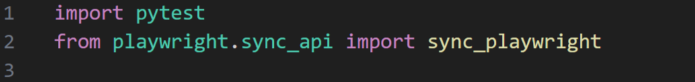
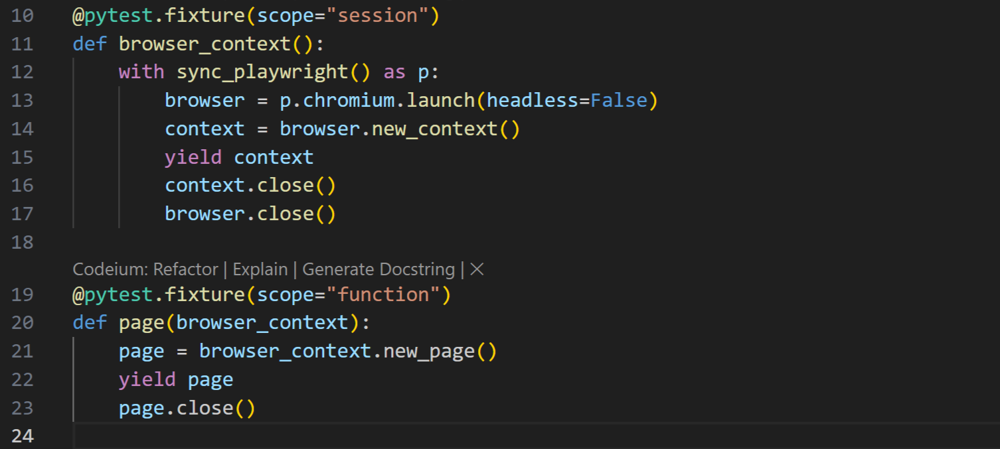
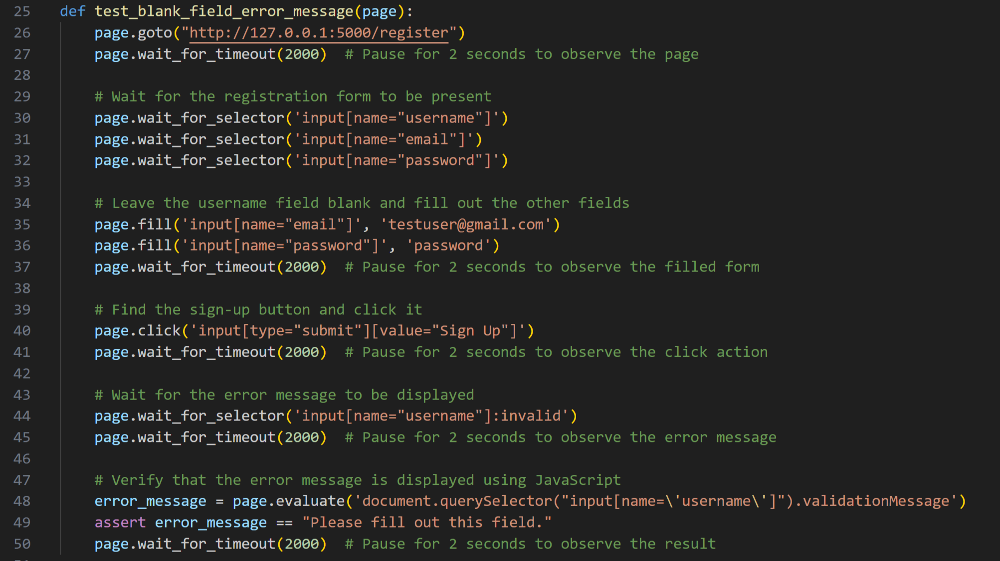
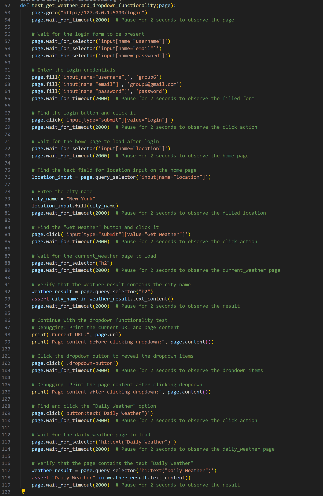
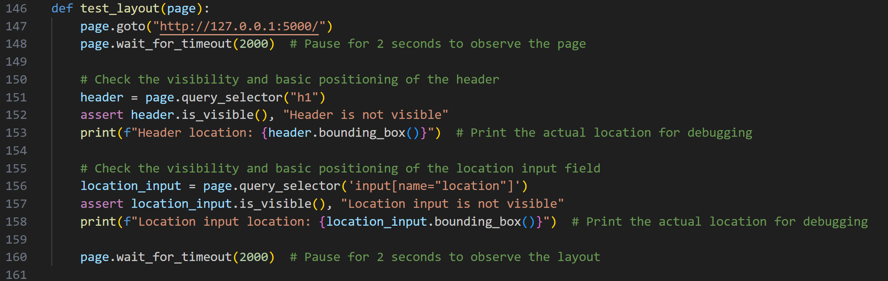
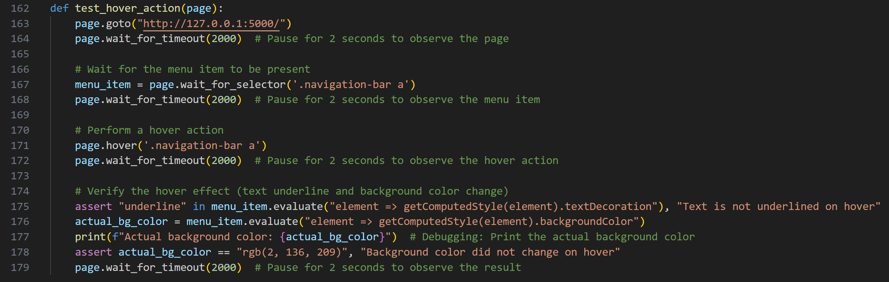
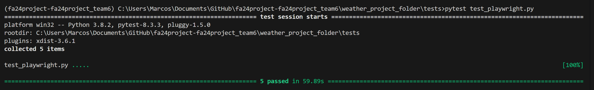

# Playwright Lab

The main focus of this lab is to teach students automation testing using Playwright, various other tools, and Oracle Forecast developed by Team 6.

## Intro to Playwright

Playwright is a framework that is used for automating web browser interactions. It supports testing across multiple browsers and provides 
tools for reliable, fast, and efficient web application testing. It is one of the newer testing tools as it was recenlty launched in 2020. It supports a variety of programming languages; 
however, this lab will focus on using Python as well as Chrome for the web browser. Follow this link to learn more about [Playwright](https://playwright.dev/docs/intro)

## Lab Objective

Using Playwright, Python, and the pytest library, students will create a variety of tests that will cover the following: form submissions, link and button clicks, dropdown menus, mouse actions, keyboard inputs, layout testing, page navigation, data entry and retrieval, data validation, error messages, and exception handling.

## Prerequisites

- Ensure you have performed the "environment_setup.md" lab before beginning.
- Familiarity with Python 3.8 or later (this lab will use Visual Studio Code for Windows as the IDE, and Google Chrome 
for the browser).
- Familiarity with Python for writing test scripts.
- Familiarity with web technologies such as CSS, HTML.
- Familiarity with Python virtual environments.
- Familiarity using the command prompt.
- Some familiarity with Playwright.
- Basic troubleshooting skills.
  
## Packages and Libraries Used

- Playwright - A browser automation framework that allows for testing of web applications across a variety of browsers (Chrome for this lab).
- Pytest - A testing framework used to write and execute simple and scalable test cases.

## Instructions

### Step 1: Setup

1. Ensure you have performed the "environment_setup.md" lab.
2. Install browsers for Playwright. After completing the "environment_setup.md" lab Playwright should already be installed, however, we must
still install the browsers that Playwright will use. Do this by running the following command:

```bash
playwright install
```
Run this simple script to ensure Playwright is installed correctly:

```python
import pytest
from playwright.sync_api import sync_playwright

def test_playwright_installation():
    with sync_playwright() as playwright:
        browser = playwright.chromium.launch()
        page = browser.new_page()
        page.goto("https://www.google.com")
        title = page.title()
        print(title)
        browser.close()
        assert "Google" in title

if __name__ == "__main__":
    pytest.main()
```
Run the script in the command prompt using:

```bash
pytest -s test_playwright_installation.py
```
You should see the title "Google" printed in the command prompt.

4. Navigate to the tests folder in the project directory.
5. Create a new file named test_playwright.py
6. Open a command prompt and use the following to launch the flask application. You may need to cd into the weather_project_folder directory.

```bash
flask run
```
5. Once the application is running open it in Chrome, navigate to the registration page and create a user with the following credentials (username: group6, email: group6@gmail.com, password: password), if the user already exists continue ahead with the lab. 

### Step 2: Step by Step Creating Test Cases

1. In the test_playwright.py file import the necessary packages.

- Pytest: Used for running the test functions.
- Sync_playwright: A synchronous API for Playwright, allows the writing of tests that interact with web browsers in a synchronous manner.

2. Create pytest fixtures. Fixtures are great for ensuring that each test starts with a clean page and that resources are properly cleaned up.

- Browser_context: sets up a browser context using Playwright, launching a Chromium browser in non-headless mode. The context is yielded and then closed after the test session.
- Page: creates a new page within the browser_context fixture, yields it, and then closes the page after each test function.

3. Create a test function "test_blank_field_error_message". This tests the registration form  to ensure that an error message is displayed when the username field is left blank.

- The page object is an instance of Playwright's Page class, which represents a browser page.
- The goto method navigates the page to the specified URL (http://127.0.0.1:5000/register), which is the registration page.
- The wait_for_selector method waits for the specified CSS selector to be visible on the page. In this case, the selectors are for the username, email, and password input fields.
This ensures that the registration form has loaded and the input fields are visible.
- The fill method fills the specified input field with the provided value. In this case, the email field is filled with testuser@gmail.com and the password field is filled with password. No action is taken to fill the username field, so it remains blank.
- The click method clicks the specified element.
- The wait_for_selector method waits for the specified CSS selector to be visible on the page. In this case, the selector is for the username input field with the :invalid pseudo-class, which indicates that the field is invalid (i.e., it has an error message).
- The evaluate method executes a JavaScript expression on the page. In this case, the expression uses document.querySelector to select the username input field and retrieves its validationMessage property, which contains the error message.
- The assert statement checks that the error message is equal to the expected value ("Please fill out this field.").

4. Create a test function "test_get_weather_and_dropdown_functionality". It will test various functionalities of the application such as fetching weather results, and dropdown functionalities.

- Navigates to the login page (http://127.0.0.1:5000/login) using the page.goto method.
- Fills out the login form with credentials (group6, group6@gmail.com, password) using the page.fill method and submits it.
- After logging in, it waits for the home page to load and enters a city name (New York) into the location input field using the location_input.fill method.
- Clicks the "Get Weather" button with the page.click method and waits for the weather result page to load.
- Verifies that the weather result contains the city name (New York).
- Tests the dropdown functionality by clicking the dropdown button, selecting the "Daily Weather" option, and verifying that the page contains the text "Daily Weather".

5. Create a test function "test_handling_exceptions". This tests the applications error handling abilities.
[Playwright Exceptions](playwright_exceptions.png)
- Navigates to the URL http://127.0.0.1:5000/ using the page.goto method.
- Finds the text field for location input on the home page using the page.query_selector method.
- Enters an invalid input (abcd1234) into the location field using the location_input.fill method.
- Finds the "Get Weather" button and clicks it using the page.click method.
- Verifies that the error message is displayed by querying the page for the text "An unexpected error occurred" using the page.query_selector method.
- Asserts that the error message is present in the text content using the assert statement.

6. Create a test function "test_layout". This tests the layout of the homepage.

- Navigates to the URL "http://127.0.0.1:5000/" using the page.goto method.
- Uses the page.query_selector method to find the h1 element on the page and assigns it to the variable header.
- Checks if the header element is visible using the header.is_visible method and raises an assertion error if it is not visible.
- Uses the page.query_selector method to find the <input> element with the name "location" and assigns it to the variable location_input.
- Checks if the location_input element is visible using the location_input.is_visible method and raises an assertion error if it is not visible.

7. Create a test function "test_hover_action". It tests the funcionality of the hover action when a user hovers their mouse over an item.

- Navigates to http://127.0.0.1:5000/.
- Wait_for_selector(): waits for an element matching the specified CSS selector to appear on the page.
In this case, the test waits for an "a" element with a parent element having the class navigation-bar to appear on the page.
The method returns an instance of the ElementHandle class, which represents the matched element.
- Simulates a hover action on the menu item.
- Menu_item.evaluate("element => getComputedStyle(element).textDecoration"):
evaluate(): executes a JavaScript function in the context of the page. In this case, the test executes a function that takes an element as an argument and returns the value of the textDecoration property of the element's computed style.
The getComputedStyle() function is a built-in JavaScript function that returns the computed style of an element.
The evaluate() method returns the result of the executed function, which is the value of the textDecoration property.
- Assert "underline" in asserts that the string "underline" is present in the value of the textDecoration property returned by the evaluate() method.
- Menu_item.evaluate("element => getComputedStyle(element).backgroundColor") is
similar to the previous evaluate(), but this time the test retrieves the value of the backgroundColor property.

9. Run the test. Open a new command prompt seperate from the one running the application. Enter this command:
```bash
pytest test_playwright.py
```
If you would like to see the print statements from the functions for debugging enter this command:
```bash
pytest -s test_playwright.py
```


Observe how Playwright takes control of the browser and interacts with it just as a user would do. 

## Try it Yourself

Now that you have a decent understanding of how Playwright, Pytest, and the Oracle Forecast application work, create your own test to validate the user registration function. Create a test that registers a new user with credentials of your own choosing, then login using those new credentials. 

## Results Overview
The test_playwright file has tested the following in various ways: form submissions, link and button clicks, dropdown menus, mouse actions, keyboard inputs, layout testing, page navigation, data entry and retrieval, data validation, error messages, and exception handling. Much like Selenium, Playwright is a powerful tool with a robust featureset, and although it isn't nearly as popular as Selenium this is only going to change as more and more developers adopt Playwright for its ease of use and capabilities. 

## Coverage Reports
This test is only part of a suite of various tests designed to create a solid testing plan. Be sure to read the coverage report included with the test suite to better understand how testing is an integral part of the development process.

### Troubleshooting Tips

- If any tests fail ensure they are setup properly. Run the test again, sometimes a test will fail due to network issues, latency issues etc. 
