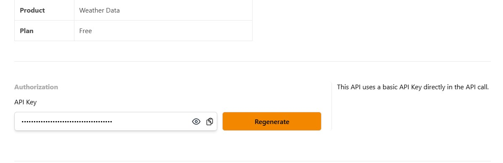
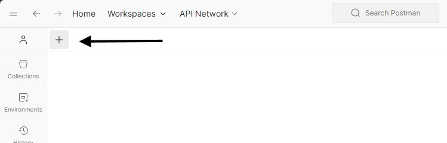
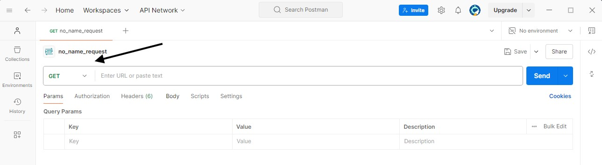
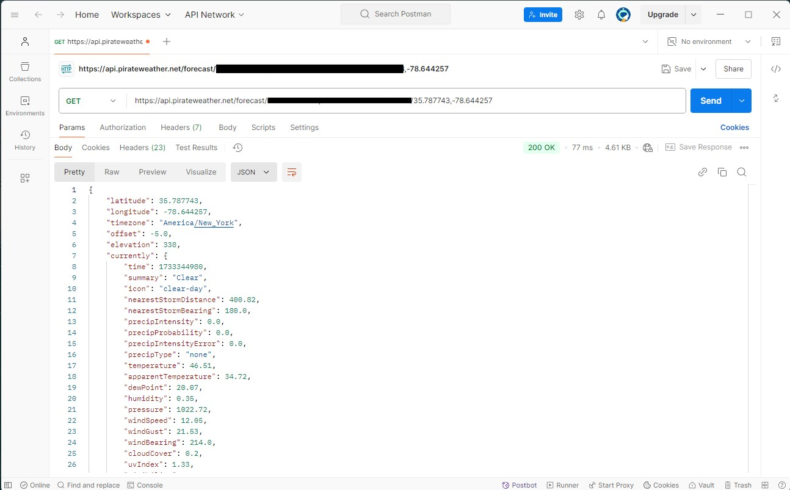
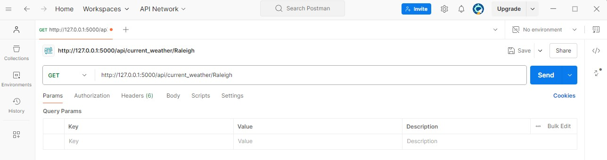
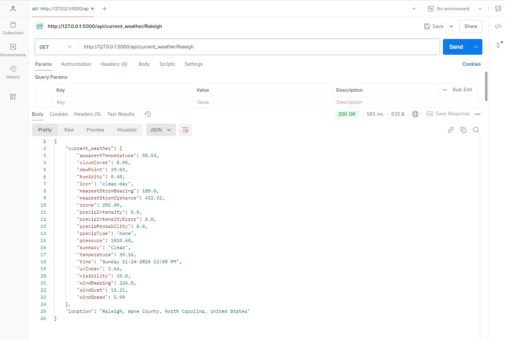
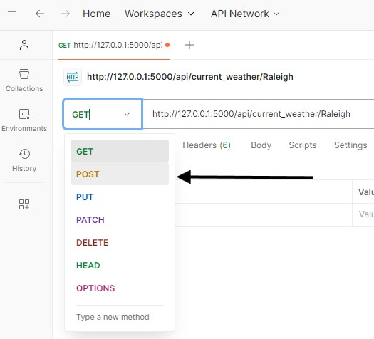
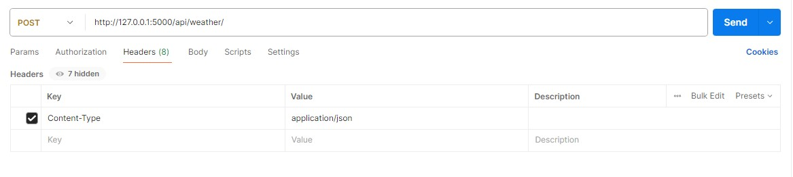
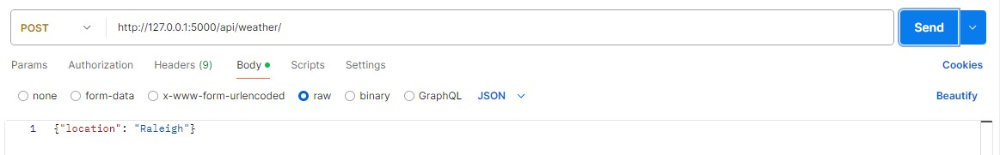
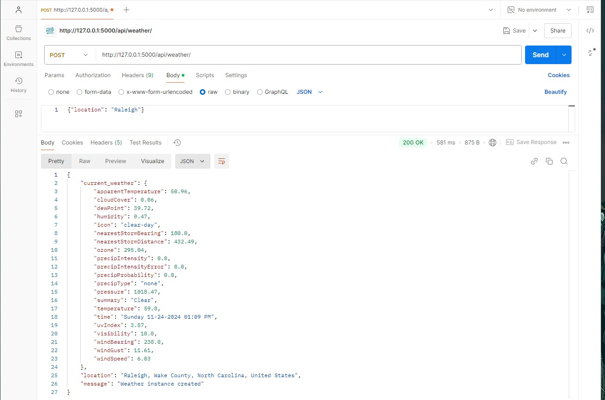

## Part 1: Testing the Public Pirate Weather API 

#### Prerequisites
- Create a postman account 
- Have the postman application installed on your machine 
- Have a Pirate Weather API account 

### Step 1 Retrieve your API key from Pirate Weather API 
1. Go to https://pirate-weather.apiable.io/ and select the ```Get an API key``` button
2. Select The Weather Data option
3. Click Subscribe underneath the FREE option 
4. Here You'll Create an account if you haven't already made one otherwise you'll sign in.
5. This should bring another form to Named ```Choose your plan```.
6. Make sure the Free option is highlighted and Name your subscription. Then Click Subscribe
7. Now you should be able to go to the My Subscriptions tab at the top of the page.
8. Under My subscriptions you can select your new named subscription.
9. Here is where you will retrieve your API key

10. Keep this page open we'll come back to retreive our API and copy it into Postman

### Step 2: Open Postman:
1. Start Postman application.
2. Open a new tab in Postman using the + button on the left of the application below the navigation bar.

3. In your new tab make sure the drop down menu shows GET as the text.
    When opening a new tab GET is the default selection.


### Step 3: Send a GET requeset to the Pirate Weather API 
Here is the Pirate Weather API URL structure we'll use to make the request ```https://api.pirateweather.net/forecast/[apikey]/[latitude],[longitude]```
1. Copy and paste this into the text bar next the GET dropdown. 

2. Let's go back to the Pirate Weather webpage that has our API Key
3. Next to the eye select the copy clipboard to copy your API Key into your clipboard.

4. Next replace the ```[apikey]``` within the Pirate Weather Request Structure URL  in postman with your API key

``` Your api key should be a string of random letters and numbers. Remember to keep your API key private```
5. Next find the Longitude and Latitude of a location. I'm simply going to google the Longitude and Latitude of Raleigh NC.
 The latiude of Raleigh is 35.787743 and the Longitude is -78.644257.
6. Replace the [latitude],[longitude] within the Pirate Weather Request Structure URL in postman with the Latitude and Longitude of your chosen location.

7. Now with your API key and your chosen location's Latitude and Longitude with the within the Pirate Weather Request Structure URL press ```Send```.
8. If your API key is active and the location's Latitude and Longitude is accurate you should receive a 200 OK response with the data returned in JSON format.

9. Scroll through and analyze the Weather Data Provided by the Pirate Weather API


## Part 2 Testing Weather Dashboard Application API endpoints with Postman

#### Prerequisites
- Create a postman account 
- Have the postman application installed on your machine 
- Ensure the Weather Dashboard Application is running locally


### Step 1 Open Postman:
1. Start Postman application.
2. Open a new tab in Postman using the + button on the left of the application below the navigation bar.


### Step 2. Create GET request
1. In your new tab make sure the drop down menu shows GET as the text.
    When opening a new tab GET is the default selection.

2. Enter the url of the local server running on your machine for the weather application.
You can test any of the GET endpoints here but let's start with current weather.
- http://127.0.0.1:5000/api/current_weather/Raleigh

- press ```send```
3. If your local application server is running and the url was void of errors you should receive a ```200 ok```response and data in the JSON format.

4. Take a few moments to try the daily weather url and hourly weather url for the other GET endpoints of the application
- http://127.0.0.1:5000/api/daily_weather/Raleigh
- http://127.0.0.1:5000/api/current_weather/Raleigh
As well try changing the location from Raleigh to another location to see if the request is still received properly.

### Step 3. Create a POST request
1. With Postman still open select the GET method drop down menu and change it to POST.

2. Change the url to to the POST API endpoint of the application .
- http://127.0.0.1:5000/api/weather/

3. Select headers under the url, and in the key field type ```Content-Type``` Under the Value field type ```application/json```.
This is telling the application what type of data to expect in the request body.

4. Select the body tab underneath the url, and click on the ```raw``` selection.
5. In the body tab with raw selected, type your location in JSON format. 
ex. ``` {"location": "Raleigh" }```

6. Press ```send``` if your data was configured correctly, the local server is running, and your url endpoint was correct you should recieve a ```200 ok```reponse. 
This response should be the current weather, the location, and a message indication that a weathe instance was created. 

