# Pytest Unit Testing Lab

The main focus of this lab is to teach students the basics of unit testing using Python, Pytest, and the Oracle Forecast application designed by Team 6.

## Intro to Pytest

Pytest is a popular testing framework for Python that simplifies the process of writing and running tests. Its main purpose is to help developers ensure their 
code works correctly by providing tools to write small, isolated tests. It supports various types of testing, including unit tests, integration tests, and functional tests.
Pytest works by discovering and running test functions in your code. You write test functions using simple assertions, and pytest automatically finds these tests and 
executes them. It provides detailed output for each test, making it easy to identify and fix issues.

## Lab Objective

Using Python, Pytest, and the Oracle Forecast application students will create a variety of tests cases to test functionalities across the entire application.

## Prerequisites

- Ensure you have performed the "environment_setup.md" lab before beginning. 
- Familiarity with Python 3.8 or later (this lab will use Visual Studio Code for Windows as the IDE, and Google Chrome 
for the browser).
- Familiarity with Python for writing test scripts.
- Familiarity with web technologies such as CSS, HTML.
- Familiarity with Python virtual environments.
- Familiarity using the command prompt.
- Some familiarity with Pytest.
- Basic troubleshooting skills.
  
## Packages and Libraries Used

- Pytest - A testing framework used to write and execute simple and scalable test cases.
- Unittest.mock - A tool for creating mock objects during testing.
- Requests - Used to send HTTP requests, handle responses, interact with web APIs by sending GET, POST, PUT, DELETE requests, etc.
  
## Instructions

### Step 1: Setup

1. Ensure you have performed the "environment_setup.md" lab.
2. Navigate to the tests folder in the project directory.

### Step 2: Step by Step Creating Test Cases

1. Create a new test file named test_app.py. It will test the Flask application instance and its components that are set up and configured in the app.py file.
The tests wil ensure that the application and its components are properly initialized and functioning correctly.

2. In test_app.py import the necessary dependencies.
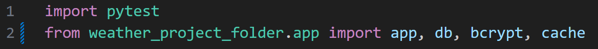
- Pytest: Used for running the test functions.
- From weather_project_folder.app import app, db, bcrypt, cache: Imports the Flask application instance (app), the SQLAlchemy database instance (db),
the bcrypt instance (bcrypt), and the cache instance (cache) from the weather_project_folder.app module.

3. Define a pytest fixture to set up the Flask application for testing.
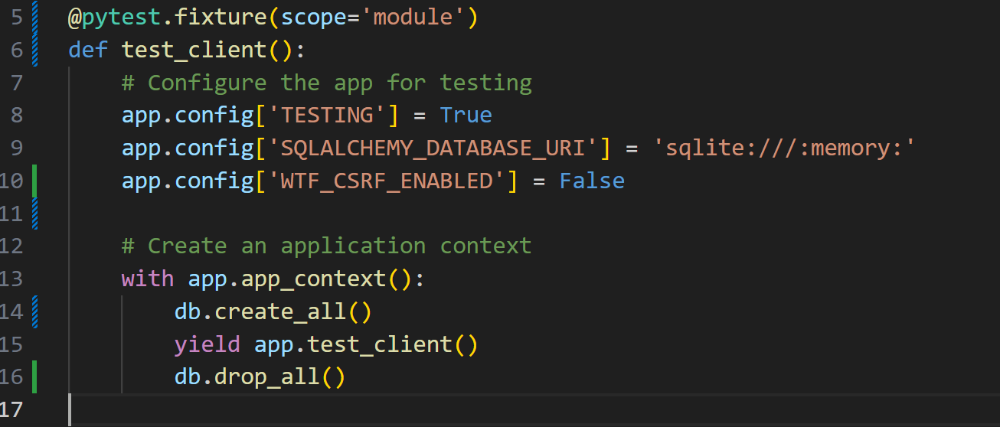
- Configures the app for testing by setting TESTING to True, using an in-memory SQLite database, and disabling CSRF protection.
- Creates an application context and initializes the database.
- Yields a test client instance, allowing tests to interact with the app.
- After the test is finished, it drops the database to clean up.

4. Create a test case "test_app_exists". A unit test that checks if the Flask applicatin instance exist.
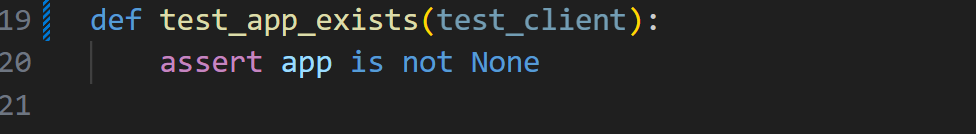
- Def test_app_exists(test_client): Defines a test function that uses the test_client fixture.
- Assert app is not None: Asserts that the Flask application instance (app) exists.

5. Create a test case "test_home_page". It verifies that the home page loads correctly.
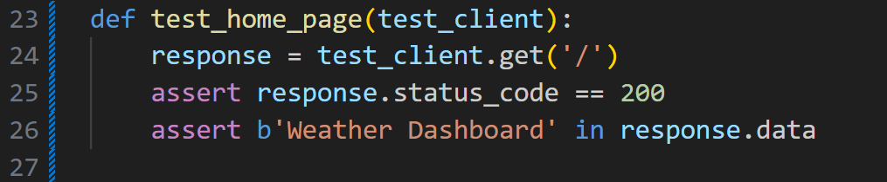
- Sends a GET request to the root URL ('/') using the test_client.
- Checks if the response status code is 200 (OK), indicating a successful request.
- Checks if the response data contains the string 'Weather Dashboard'.

6. Create a test case "test_database_initialization". It will check if the 'user' table exists in the database after intialization.
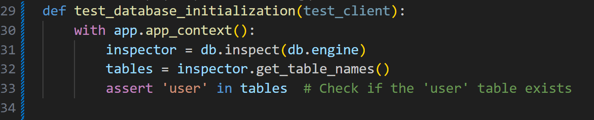
- With app.app_context(): creates an application context for the test.
- Inspector = db.inspect(db.engine): creates a database inspector object to examine the database schema.
- Tables = inspector.get_table_names(): retrieves a list of table names from the database.
- Assert 'user' in tables: checks if the 'user' table is present in the list of tables. If it's not, the test will fail.

7. Create a test case "test_login_manager_initialization". This is a unit test that checks login manager attribute of the app object is initialized.

- Def test_login_manager_initialization(test_client): Defines a test function that uses the test_client fixture.
- Assert app.login_manager is not None: Asserts that the login manager instance (app.login_manager) exists.

8. Create a test case "test_bcrypt_initialization". This test ensures that the bcrypt extension is initialized and can be used for password hashing and encryption.
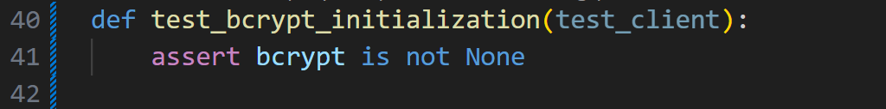
- Def test_bcrypt_initialization(test_client): Defines a test function that uses the test_client fixture.
- Assert bcrypt is not None: Asserts that the bcrypt instance (bcrypt) exists.

9. Create a test case "test_cache_initialization". This is a unit testthat checks if the cache object has been initialized correctly.
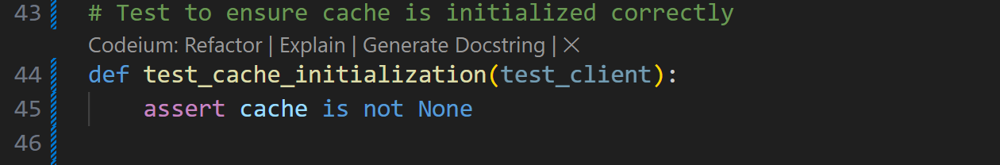
- Def test_cache_initialization(test_client): Defines a test function that uses the test_client fixture.
- Assert cache is not None: Asserts that the cache instance (cache) exists.

10. Create a test case "test_blueprints_registration". This tests whether the blueprints are registered in the application.
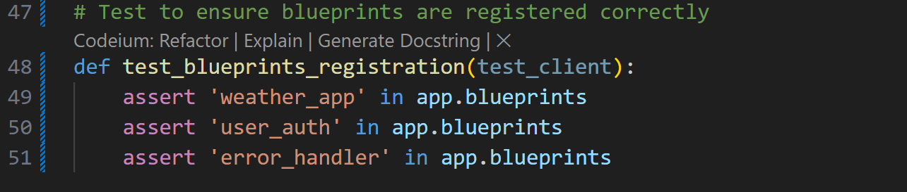
- Def test_blueprints_registration(test_client): Defines a test function that uses the test_client fixture.
- Assert 'weather_app' in app.blueprints: Asserts that the weather_app blueprint is registered in the application.
- Assert 'user_auth' in app.blueprints: Asserts that the user_auth blueprint is registered in the application.
- Assert 'error_handler' in app.blueprints: Asserts that the error_handler blueprint is registered in the application.

12. Run the test. Open a command prompt and ensure you are in the tests directory, use this command:
```bash
pytest test_app.py
```
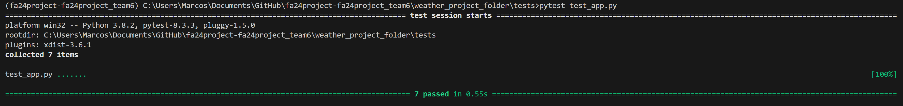

13. Create a new test file named "test_user_auth.py". This file is a test suite for the user authentication components of the application.

14. In "test_user_auth.py" import the necessary packages.
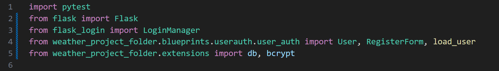
- Import pytest: Imports the pytest library, which is used for writing and running test cases.
- From flask import Flask: Imports the Flask class to create a Flask application instance.
- From flask_login import LoginManager: Imports the LoginManager class from Flask-Login to manage user sessions.
- From weather_project_folder.blueprints.userauth.user_auth import User, RegisterForm, load_user: Imports the User model, RegisterForm class, and load_user function from the user authentication blueprint.
- From weather_project_folder.extensions import db, bcrypt: Imports the SQLAlchemy database instance (db) and the bcrypt instance (bcrypt) from the extensions module.

15. Define a pytest fixture to set up an in-memory SQLite database, initiallizze various extensions, and create database tables.
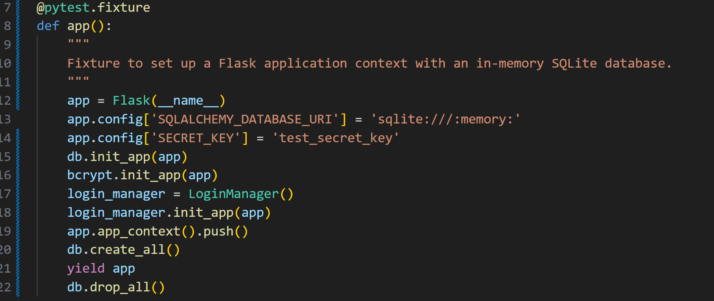
- Create a new instance of the Flask web framework, passing the current module name (__name__) as the app name.
- Set the database URI to an in-memory SQLite database, which means the database will be created in RAM and deleted when the test is finished.
- Set a secret key for the app, which is used for security purposes such as signing session cookies.
- Initialize the database (using SQLAlchemy) and bcrypt (a password hashing library) with the Flask app.
- Create a new instance of the LoginManager class and initialize it with the Flask app.
- Push the app context which makes the app instance available to other parts of the code.
- Create all the database tables defined in the app's models.
- Yield the app instance to the test, allowing it to use the app for testing purposes.
- After the test is finished it drops all the database tables to clean up.

16. Create a test case "test_validate_username". This tests the validate_username method of the RegisterForm class.
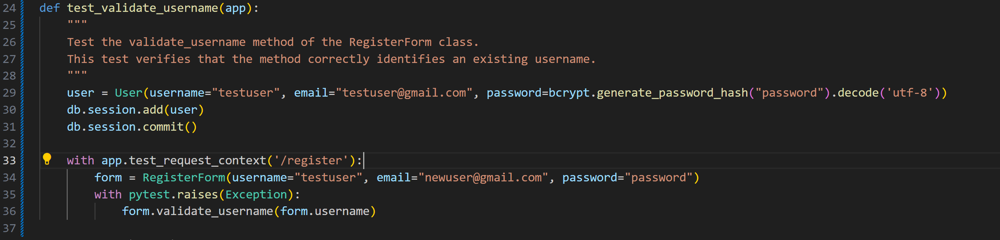
- Def test_validate_username(app):: Defines a test function that uses the app fixture.
- Docstring: Describes the purpose of the test, which is to verify that the validate_username method of the RegisterForm class correctly identifies an existing username.
- User = User(...): Creates a new User instance with the username "testuser".
- Db.session.add(user): Adds the new user to the database session.
- Db.session.commit(): Commits the transaction to save the user to the database.
- With app.test_request_context('/register'): Creates a test request context for the /register endpoint.
- Form = RegisterForm(...): Creates a new RegisterForm instance with the username "testuser".
- With pytest.raises(Exception):: Asserts that an exception is raised when calling form.validate_username(form.username), indicating that the username "testuser" already exists.

17. Create a test case "test_load_user". This test checks if load_user correctly retireves a user from the database.
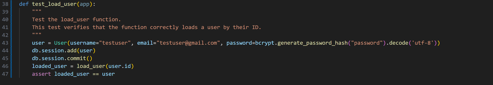
- User = User(...): Creates a new User instance with the username "testuser".
- Db.session.add(user): Adds the new user to the database session.
- Db.session.commit(): Save the user to the database.
- Loaded_user = load_user(user.id): Calls the load_user function with the user's ID and stores the result in loaded_user.
- Assert loaded_user == user: Asserts that the loaded user is the same as the original user.

18. Run the test. Open a command prompt and ensure you are in the tests directory, use this command:
```bash
pytest test_user_auth.py
```
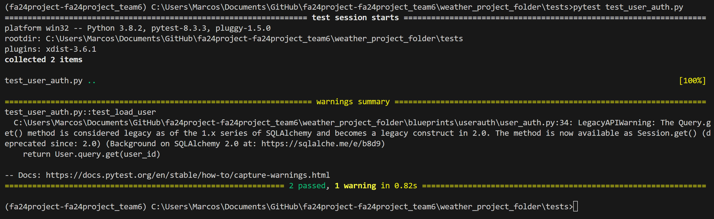

19. Create a new test file named "test_weather_api". It mocks the requests.get method and tests the behavior of the get_weather_data function.

20. In "test_weather_api" import the necessary packages.
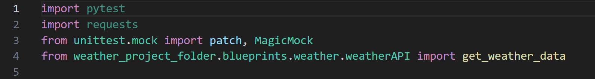
- Import pytest: Imports the pytest library, which is used for writing and running test cases.
- Import requests: Imports the requests library, which is used for sending HTTP requests.
- From unittest.mock import patch, MagicMock: Imports the patch and MagicMock classes from the unittest.mock library. These are used to mock the requests.get method and create mock responses.
- From weather_project_folder.blueprints.weather.weatherAPI import get_weather_data: Imports the get_weather_data function from the weatherAPI module.

21. Create test case "test_get_weather_data". The test calls the get_weather_data function with some coordinates and asserts that the returned weather data matches the mock response.
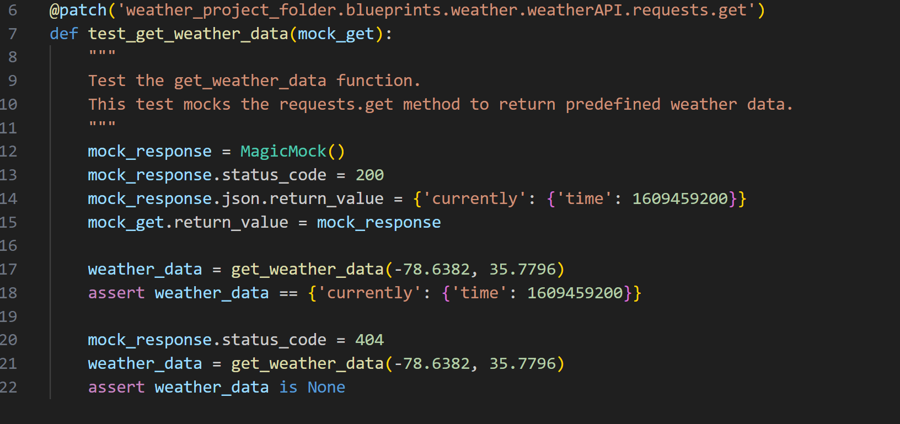
- @patch('weather_project_folder.blueprints.weather.weatherAPI.requests.get'): This decorator patches the requests.get method in the weatherAPI module with a mock object. The mock object is passed as an argument (mock_get) to the test_get_weather_data function.
- Def test_get_weather_data(mock_get):: Defines the test_get_weather_data test function, which takes the mock object (mock_get) as an argument.
- Mock_response = MagicMock(): Creates a mock response object using MagicMock.
- Mock_response.status_code = 200: Sets the status code of the mock response to 200 (OK).
- Mock_response.json.return_value = {'currently': {'time': 1609459200}}: Sets the return value of the json method of the mock response to a predefined JSON object representing weather data.
- Mock_get.return_value = mock_response: Sets the return value of the mocked requests.get method to the mock response object.
- Weather_data = get_weather_data(-78.6382, 35.7796): Calls the get_weather_data function with the coordinates for Raleigh, NC (-78.6382, 35.7796) and stores the result in weather_data.
- Assert weather_data == {'currently': {'time': 1609459200}}: Asserts that the returned weather data matches the predefined JSON object.
- Mock_response.status_code = 404: Changes the status code of the mock response to 404 (Not Found).
- Weather_data = get_weather_data(-78.6382, 35.7796): Calls the get_weather_data function again with the same coordinates and stores the result in weather_data.
- Assert weather_data is None: Asserts that the returned weather data is None, indicating that the function correctly handles a 404 response.

22. Run the test. Open a command prompt and ensure you are in the tests directory, use this command:
```bash
pytest test_weather_api.py
```
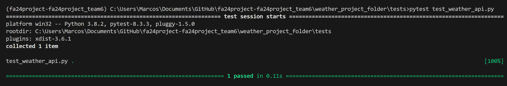

23. Create a new test file named "test_weather_object.py". This is a unit test for the get_coordinates method of the Weather class. It tests whether the method correctly retrieves coordinates for a given location ("Raleigh") by mocking the Nominatim geolocator to return predefined coordinates.

24. In the test file "test_weather_object.py" import the required packages
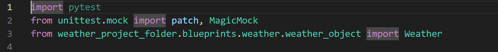
- Import pytest: Imports the pytest library, which is used for writing and running test cases.
- From unittest.mock import patch, MagicMock: Imports the patch and MagicMock classes from the unittest.mock library. These are used to mock the Nominatim geolocator and create mock responses.
- From weather_project_folder.blueprints.weather.weather_object import Weather: Imports the Weather class from the weather_object module.

25. Create test case "test_get_coordinates". 
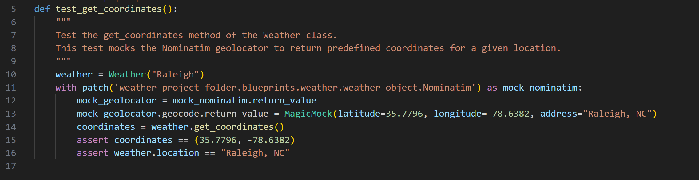
- Def test_get_coordinates(): Defines the test_get_coordinates test function.
- Weather = Weather("Raleigh"): Creates a new Weather instance with the location "Raleigh".
- With patch('weather_project_folder.blueprints.weather.weather_object.Nominatim') as mock_nominatim:: Patches the Nominatim geolocator in the weather_object module with a mock object. The mock object is assigned to mock_nominatim.
- Mock_geolocator = mock_nominatim.return_value: Sets the return value of the mock_nominatim object to mock_geolocator.
- Mock_geolocator.geocode.return_value = MagicMock(latitude=35.7796, longitude=-78.6382, address="Raleigh, NC"): Sets the return value of the geocode method of the mock_geolocator to a mock object with predefined latitude, longitude, and address.
- Coordinates = weather.get_coordinates(): Calls the get_coordinates method of the Weather instance and stores the result in coordinates.
- Assert coordinates == (35.7796, -78.6382): Asserts that the returned coordinates match the predefined coordinates (35.7796, -78.6382).
- Assert weather.location == "Raleigh, NC": Asserts that the location attribute of the Weather instance is set to "Raleigh, NC".

26. Run the test. Open a command prompt and ensure you are in the tests directory, use this command:
```bash
pytest test_weather_object.py
```
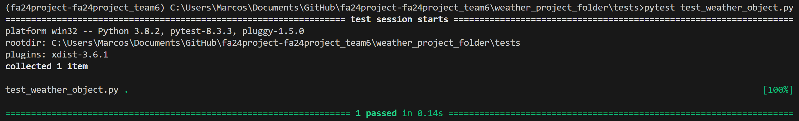

27. Create a new test file named "test_weatherapp.py". This file will run tests taht ensure the weather endpoints are working correctly.

28. In the "test_weatherapp.py" file import all required packages.
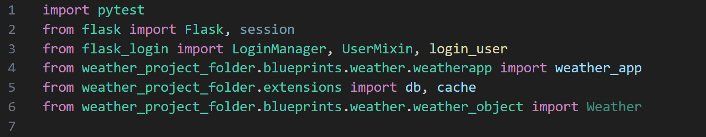
- Import pytest: Imports the pytest library, which is used for writing and running test cases.
- From flask import Flask, session: Imports the Flask class to create a Flask application instance and the session object to manage user sessions.
- From flask_login import LoginManager, UserMixin, login_user: Imports the LoginManager, UserMixin, and login_user functions from Flask-Login to manage user sessions and log in users.
- From weather_project_folder.blueprints.weather.weatherapp import weather_app: Imports the weather_app blueprint.
- From weather_project_folder.extensions import db, cache: Imports the SQLAlchemy database instance (db) and the cache instance (cache) from the extensions module.
- From weather_project_folder.blueprints.weather.weather_object import Weather: Imports the Weather class from the weather_object module.

29. Create a "User" class.This class definition defines a User class that inherits from UserMixin, which is a mixin class provided by Flask-Login to implement user authentication.
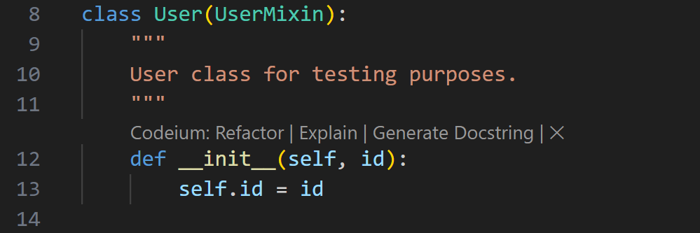
- Init(self, id): Initializes a new User instance with a given id, which is stored as an instance attribute. This method is used to create a new user object for testing purposes.

30. Define a pytest fixture "app" to create a flask app, configure it, and yield it for testing.
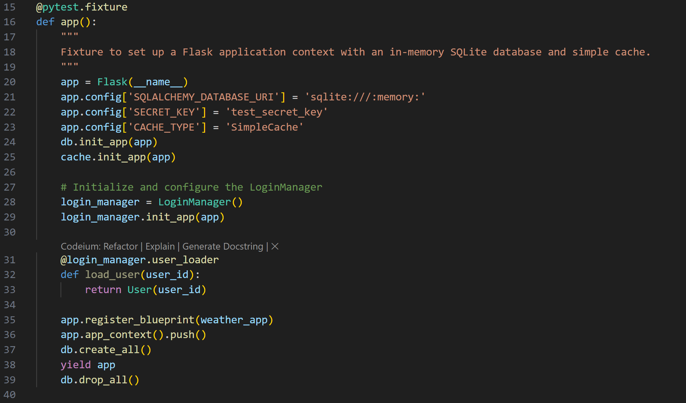
- @pytest.fixture: Defines a pytest fixture named app.
- Def app():: Defines the app fixture function.
- App = Flask(__name__): Creates a new Flask application instance.
- App.config['SQLALCHEMY_DATABASE_URI'] = 'sqlite:///:memory:': Configures the application to use an in-memory SQLite database for testing.
- App.config['SECRET_KEY'] = 'test_secret_key': Sets a secret key for the application.
- App.config['CACHE_TYPE'] = 'SimpleCache': Configures the application to use a simple cache.
- Db.init_app(app): Initializes the SQLAlchemy database instance with the Flask application.
- Cache.init_app(app): Initializes the cache instance with the Flask application.
- Login_manager = LoginManager(): Creates a new LoginManager instance.
- Login_manager.init_app(app): Initializes the LoginManager instance with the Flask application.
- @login_manager.user_loader: Defines a user loader function for the LoginManager.
- Def load_user(user_id):: Defines the load_user function that returns a User instance with the given user_id.
- App.register_blueprint(weather_app): Registers the weather_app blueprint with the Flask application.
- App.app_context().push(): Pushes the application context to make it the current context.
- Db.create_all(): Creates all the database tables defined in the SQLAlchemy models.
- Yield app: Yields the Flask application instance for use in the tests.
- Db.drop_all(): Drops all the database tables after the tests have completed.

31. Define a pytest fixture "client" to set up a test client.
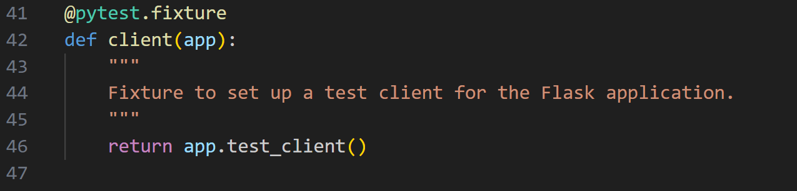
- @pytest.fixture: Defines a pytest fixture named client.
- Def client(app): Defines the client fixture function that takes the app fixture as an argument.
- Return app.test_client(): Returns a test client for making requests to the Flask application.

32. Create a helper function "login_test_user". This function logs in a test user for testing purpposes.
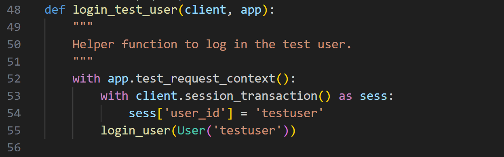
- Def login_test_user(client, app):: Defines a helper function to log in the test user.
- With app.test_request_context():: Creates a test reques context.
- With client.session_transaction() as sess:: Opens a session transaction.
- Sess['user_id'] = 'testuser': Sets the user_id in the session to 'testuser'.
- Login_user(User('testuser')): Logs in the test user using the login_user function.

33. Create a test case "test_api_get_weather". This test checks that the api_get_weather endpoint returns current weather data successfully.
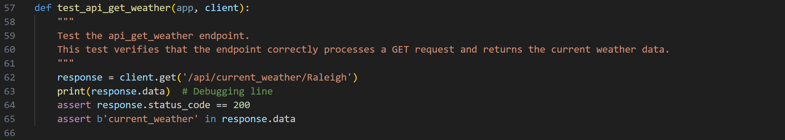
- Def test_api_get_weather(app, client):: Defines a test function that uses the app and client fixtures.
- Response = client.get('/api/current_weather/Raleigh'): Sends a GET request to the /api/current_weather/Raleigh endpoint.
- Assert response.status_code == 200: Asserts that the response status code is 200 (OK).
- Aassert b'current_weather' in response.data: Asserts that the response data contains the text 'current_weather'.

34. Create a test case "test_api_get_daily_weather". This test verifies the api_get_daily_weather endpoint.
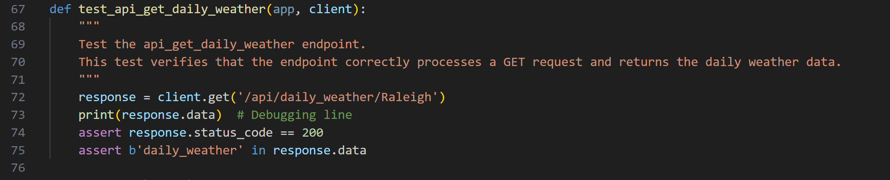
- Def test_api_get_daily_weather(app, client):: Defines a test function that uses the app and client fixtures.
- Response = client.get('/api/daily_weather/Raleigh'): Sends a GET request to the /api/daily_weather/Raleigh endpoint.
- Assert response.status_code == 200: Asserts that the response status code is 200 (OK).
- Assert b'daily_weather' in response.data: Asserts that the response data contains the text 'daily_weather'.

35. Create a test case "test_api_get_hourly_weather". This test verifies the api_get_hourly_weather endpoint.
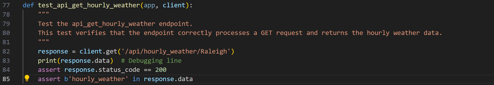
- Def test_api_get_hourly_weather(app, client):: Defines a test function that uses the app and client fixtures.
- Response = client.get('/api/hourly_weather/Raleigh'): Sends a GET request to the /api/hourly_weather/Raleigh endpoint.
- Assert response.status_code == 200: Asserts that the response status code is 200 (OK).
- Assert b'hourly_weather' in response.data: Asserts that the response data contains the text 'hourly_weather'.

36. Create a test case "test_get_daily_weather_not_found". This tests the /daily_weather route when the requested location does not exist.
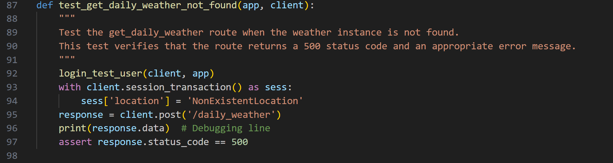
- Def test_get_daily_weather_not_found(app, client):: Defines a test function that uses the app and client fixtures.
- Login_test_user(client, app): Logs in the test user using the login_test_user helper function.
- With client.session_transaction() as sess:: Opens a session transaction.
- Sess['location'] = 'NonExistentLocation': Sets the location in the session to 'NonExistentLocation'.
- Response = client.post('/daily_weather'): Sends a POST request to the /daily_weather endpoint.
- Assert response.status_code == 500: Asserts that the response status code is 500 (Internal Server Error).

37. Create a test case "test_get_hourly_weather_not_found". This tests the /hourly_weather route when the requested location does not exist.
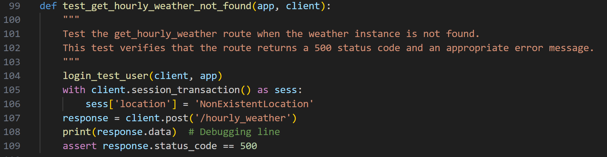
- Def test_get_hourly_weather_not_found(app, client):: Defines a test function that uses the app and client fixtures.
- Login_test_user(client, app): Logs in the test user using the login_test_user helper function.
- With client.session_transaction() as sess:: Opens a session transaction.
- Sess['location'] = 'NonExistentLocation': Sets the location in the session to 'NonExistentLocation'.
- Response = client.post('/hourly_weather'): Sends a POST request to the /hourly_weather endpoint.
- Assert response.status_code == 500: Asserts that the response status code is 500 (Internal Server Error).

38.  Run the test. Open a command prompt and ensure you are in the tests directory, use this command:
```bash
pytest test_weatherapp.py
```
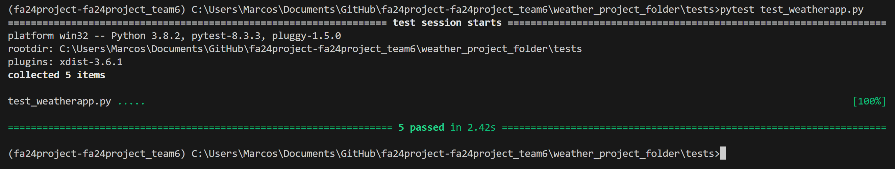
    
## Try it Yourself

Now that you have a decent grasp on using Pytest for unit testing, create more tests that verify more API endpoint functionalities. 

## Results Overview
This suite of tests covers a variety of important aspects of the application, including user authentication, weather data retreival, and APAI endpoint functionality.

## Coverage Reports
This test is only part of a suite of various tests designed to create a solid and robust testing plan. Be sure to read the coverage report included with the test suite to better understand how testing is an integral part of the development process.

### Troubleshooting Tips

- If any tests fail ensure they are setup properly.
- Run VSCode in admin mode.
- Ensure you're saving the python files after every update.
