# Requests API Lab

The main focus of this lab is to teach students API testing using the Requests Library in Python. Students will use Python, Requests Library and the Oracle Forecast application developed by Team 6.

## Intro to Requests Library

The Requests Library is a tool that helps to interact with web services, it simplifies the process of making HTTP requests, like getting data from a website or API. Requests is very easy to use, with a simple and clear interface. It supports various HTTP methods, such as GET, POST, PUT, and DELETE, allowing you to interact with web services in different ways. The library can manage cookies and sessions for you, making it easier to handle multiple requests. You can also customize your requests by adding custom headers and data. Additionally, Requests ensures your data is secure by verifying SSL certificates by default. Use this link to learn more about the [Requests Library](https://requests.readthedocs.io/en/latest/).

## Lab Objective

Using Requests, Python, Pytest, and BeautifulSoup, users will create various tests cases to verify the functionality of API endpoints in the Oracle Forecast application.

## Prerequisites

- Ensure you have performed the "environment_setup.md" lab before beginning. 
- Familiarity with Python 3.8 or later (this lab will use Visual Studio Code for Windows as the IDE, and Google Chrome 
for the browser).
- Familiarity with Python for writing test scripts.
- Familiarity with web technologies such as CSS, HTML.
- Familiarity with Python virtual environments.
- Familiarity using the command prompt.
- Some familiarity with Requests.
- Basic troubleshooting skills.
  
## Packages and Libraries Used

- Requests - Used to send HTTP requests, handle responses, interact with web APIs by sending GET, POST, PUT, DELETE requests, etc.
- Pytest - A testing framework used to write and execute simple and scalable test cases.
- BeautifulSoup - Used for parsing HTML and XML documents.
  
## Instructions

### Step 1: Setup

1. Ensure you have performed the "environment_setup.md" lab.
2. Navigate to the tests folder in the project directory.
3. Create a new file name test_requests_api.py
4. Open a command prompt and use the following to launch the flask application. You may need to cd into the weather_project_folder directory.

```bash
flask run
```

### Step 2: Step by Step Creating Test Cases

1. In the test_requests_api.py file import the required packages. 
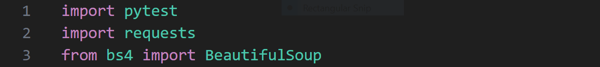
- Import pytest: Imports the pytest framework for writing and running test cases.
- Import requests: Imports the requests library for sending HTTP requests.
- From bs4 import BeautifulSoup: Imports the BeautifulSoup class from the bs4 module for parsing HTML.

2. Define the base URL for the API being tested.
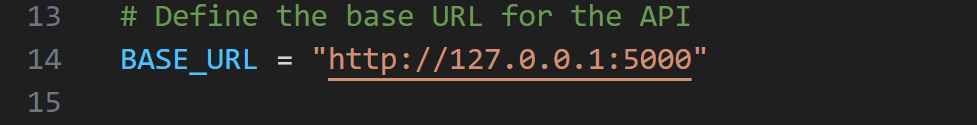
- Defines a constant BASE_URL with the value http://127.0.0.1:5000.

3. Define a pytest fixture with function scope. It will be setup fior each test function.
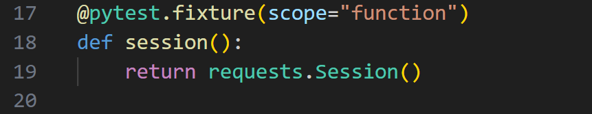
- The session fixture creates a new requests.Session() object for each test function that uses it, allowing tests to make HTTP requests. The scope="function" parameter means a new session is created for each test function, rather than for the entire test module or test class.

4. Define a helper function "get_csrf_token". A helper function is a function that is designed to assist or support other functions or parts of a program. They help to avoid code duplication and improve readability. This function retrieves a CSRF (Cross-Site Request Forgery) token.
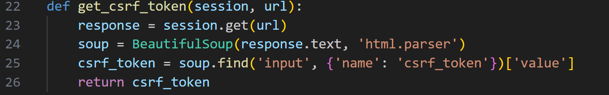
-  A CSRF (Cross-Site Request Forgery) token is a unique, secret, and unpredictable value that is generated by the server and included in web forms to protect against CSRF attacks. CSRF attacks occur when a malicious website tricks a user's browser into making an unwanted request to another site where the user is authenticated. The CSRF token ensures that the request is coming from the authenticated user and not from a malicious site. It is included in the form data and verified by the server when the form is submitted.
- Def get_csrf_token(session, url): Defines a helper function to get the CSRF token.
- Response = session.get(url): Sends a GET request to the specified URL.
- Soup = BeautifulSoup(response.text, 'html.parser'): Parses the HTML response using BeautifulSoup.
- Csrf_token = soup.find('input', {'name': 'csrf_token'})['value']: Extracts the CSRF token from the HTML form.
- Return csrf_token: Returns the CSRF token.

5. Define a helper function "prepare_payload".
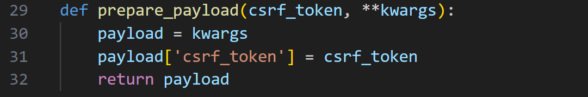
- Def prepare_payload(csrf_token, **kwargs): Defines a helper function to prepare the payload with the CSRF token. In the context of HTTP requests, a payload refers to the data being sent in the body of the request, typically in a JSON or form-encoded format. It's the actual data being transmitted, as opposed to headers or other metadata. Think of it as the "cargo" being carried by the request.
- Payload = kwargs: Initializes the payload with the provided keyword arguments.
- Payload['csrf_token'] = csrf_token: Adds the CSRF token to the payload.
- Return payload: Returns the prepared payload.

6. Create test case "test_register". It ensures that a user can successfully register on the application.
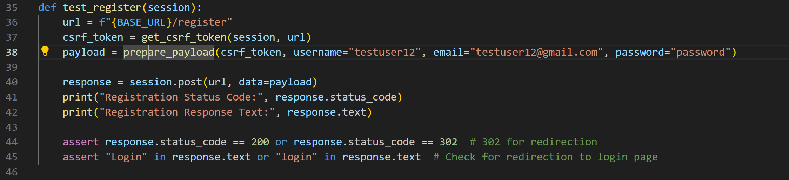
- Def test_register(session): Defines a test function that uses the session fixture.
- Url = f"{BASE_URL}/register": Constructs the URL for the registration endpoint.
- Csrf_token = get_csrf_token(session, url): Retrieves the CSRF token using the helper function.
- Payload = prepare_payload(csrf_token, username="testuser12", email="testuser12@gmail.com", password="password"): Prepares the payload with the CSRF token and user credentials.
- Response = session.post(url, data=payload): Sends a POST request with the payload to register the user.
- Assert response.status_code == 200 or response.status_code == 302: Asserts that the status code is 200 (OK) or 302 (Found, for redirection).
- Assert "Login" in response.text or "login" in response.text: Asserts that the response contains "Login" or "login", indicating a successful registration.

7. Create test case "test_register_existing_user". It verifies that the application correctly handles registration attempts with existing usernames.
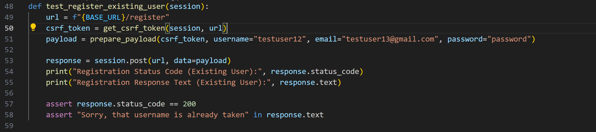
- Sends a POST request to the registration endpoint with a payload containing the existing username, email, and password.
- Asserts that the response status code is 200 and the response text contains the error message "Sorry, that username is already taken".

8. Create test case "test_login". It tests the login functionality of the application to ensure that it works as expected.
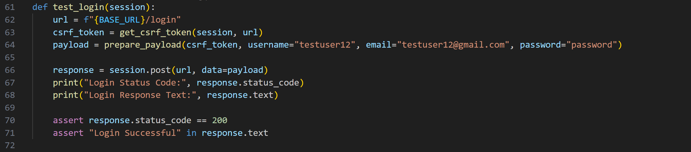
- Sends a POST request to the login URL with a payload containing a CSRF token, username, email, and password.
- Asserts that the response status code is 200 (OK) and the response text contains "Login Successful".

9. Create test case "test_login_invalid_credentials". It tests to verify that the login functionality correctly handlesinvalid credentials.
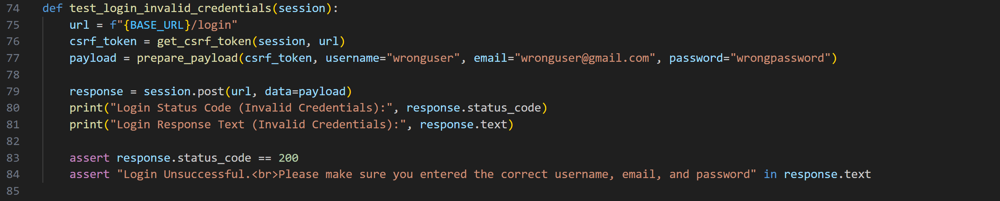
- Sends a POST request to the login page with a wrong username, email, and password.
- Verifies that the login was unsuccesful by checking the response status code (200) and the presence of "Login Unsuccessful. Please make sure you entered the correct username, email, and password".

10. Create test case "test_logout". It tests from logging in to logging out, and verifies that the application responds correctly to these actions.
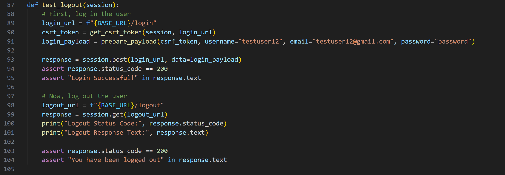
- Sends a POST request to the login URL with a payload containing a CSRF token, username, email, and password.
- After verifying a successful login, it sends a GET request to the logout URL to log out the user.
- Checks if the logout was successful by verifying the response status code (200) and the presence of "You have been logged out" in the response text.

11. Create test case "test_get_current_weather". It tests to see if the API endpoint for fetching current weather data returns a successful response and contains the expected data.  
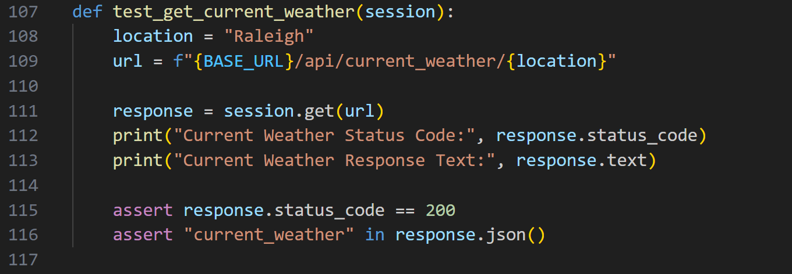
- The variable "location" is set to the string "Raleigh", which specifies the location for which the weather data will be fetched.
- The variable "url" is constructed using the base URL (BASE_URL) and the location. This URL points to the API endpoint for fetching current weather data for Raleigh.
- A GET request is sent to the constructed URL, The response from the server is stored in the response variable.
- Asserts that the status code is 200 (OK) and that the response contains the key "current_weather" in its JSON data.

12. Create test case "test_get_daily_weather". It test to see if the API endpoint for fetching daily weather data returns a successful response and contains the expected data.  
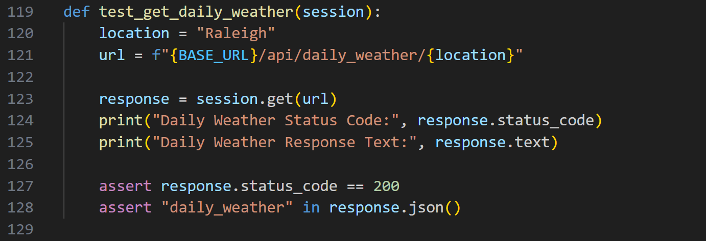
- Sends a GET request to the API endpoint for daily weather data in Raleigh.
- Asserts that the status code is 200 (OK) and that the response contains the key "daily_weather" in its JSON data.

13. Create test cast "test_get_hourly_weather". It tests to see if the API endpoint for fetching hourly weather data returns a successful response and contains the expected data.
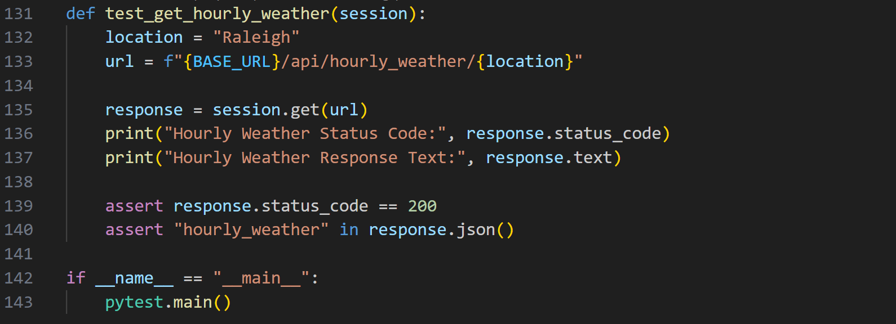
- Sends a GET request to the API endpoint for current weather data in Raleigh.
- Asserts that the status code is 200 (OK) and that the response contains the key "hourly_weather" in its JSON data.

14. Run the test. Open a new command prompt seperate from the one running the application. Enter this command:
```bash
pytest test_requests_api.py
```
If you would like to see the print statements from the functions for debugging enter this command, careful it is a lot of data!:
```bash
pytest -s test_requests_api.py
```
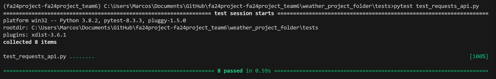

## Try it Yourself

You should now have a decent understand of using the Requests Library. Can you create a test that combines the registration, login, and logout functionalities in one?

## Results Overview
The test_requests_api file has tested various API endpoints of the Oracle Forecast application. We can be ensured that the API endpoints function correctly.

## Coverage Reports
This test is only part of a suite of various tests designed to create a solid testing plan. Be sure to read the coverage report included with the test suite to better understand how testing is an integral part of the development process.

### Troubleshooting Tips

- If any tests fail ensure they are setup properly. Run the test again, sometimes a test will fail due to network issues, latency issues etc. 
