# Requests API Lab

The main focus of this lab is to teach students API testing using the Requests Library in Python. Students will use Python, Requests Library and the Oracle Forecast application developed by Team 6.

## Intro to Requests Library

The Requests Library is a tool that helps to interact with web services, it simplifies the process of making HTTP requests, like getting data from a website or API. Requests is very easy to use, with a simple and clear interface. It supports various HTTP methods, such as GET, POST, PUT, and DELETE, allowing you to interact with web services in different ways. The library can manage cookies and sessions for you, making it easier to handle multiple requests. You can also customize your requests by adding custom headers and data. Additionally, Requests ensures your data is secure by verifying SSL certificates by default. Use this link to learn more about the [Requests Library](https://requests.readthedocs.io/en/latest/).

## Lab Objective

Using Requests, Python, Pytest, and BeautifulSoup, users will create various tests cases to verify the functionality of API endpoints in the Oracle Forecast application.

## Prerequisites

- Ensure you have performed the "environment_setup.md" lab before beginning. 
- Familiarity with Python 3.8 or later (this lab will use Visual Studio Code for Windows as the IDE, and Google Chrome 
for the browser).
- Familiarity with Python for writing test scripts.
- Familiarity with web technologies such as CSS, HTML.
- Familiarity with Python virtual environments.
- Familiarity using the command prompt.
- Some familiarity with Requests.
- Basic troubleshooting skills.
  
## Packages and Libraries Used

- Requests - Used to send HTTP requests, handle responses, interact with web APIs by sending GET, POST, PUT, DELETE requests, etc.
- Pytest - A testing framework used to write and execute simple and scalable test cases.
- BeautifulSoup - Used for parsing HTML and XML documents.
  
## Instructions

### Step 1: Setup

1. Ensure you have performed the "environment_setup.md" lab.
2. Navigate to the tests folder in the project directory.
3. Create a new file name test_requests_api.py
4. Open a command prompt and use the following to launch the flask application. You may need to cd into the weather_project_folder directory.

```bash
flask run
```

### Step 2: Step by Step Creating Test Cases

1. In the test_requests_api.py file import the required packages. 
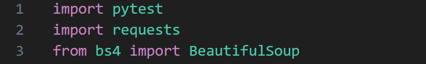
- Import pytest: Imports the pytest framework for writing and running test cases.
- Import requests: Imports the requests library for sending HTTP requests.
- From bs4 import BeautifulSoup: Imports the BeautifulSoup class from the bs4 module for parsing HTML.

3. Define the base URL for the API being tested.
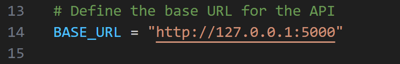
- Defines a constant BASE_URL with the value http://127.0.0.1:5000.

4. Define a pytest fixture with function scope. It will be setup fior each test function.
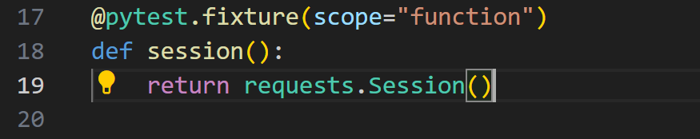
- The session fixture creates a new requests.Session() object for each test function that uses it, allowing tests to make HTTP requests. The scope="function" parameter means a new session is created for each test function, rather than for the entire test module or test class.

5. Create test case "test_register". It ensures that a user can successfully register on the application.
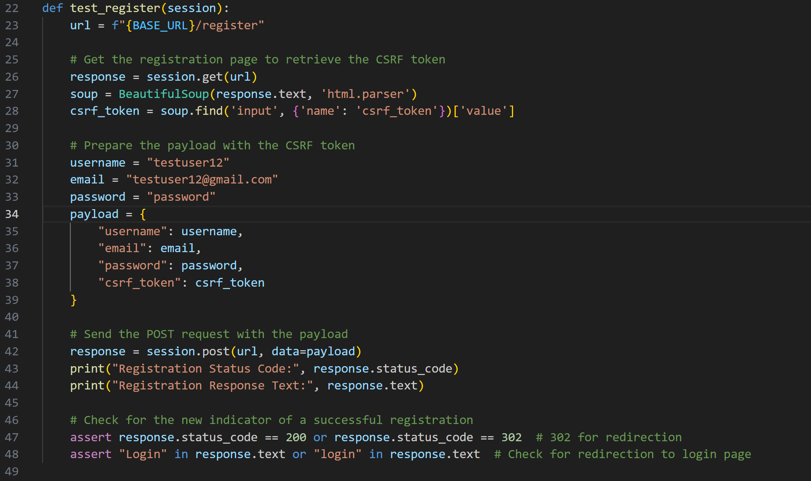
- Send a GET request to the registration page to retrieve a CSRF (Cross-Site Request Forgery) token. A CSRF token is a unique, secret, and unpredictable value that is generated by the server and included in web forms to protect against CSRF attacks. CSRF attacks occur when a malicious website tricks a user's browser into making an unwanted request to another site where the user is authenticated. The CSRF token ensures that the request is coming from the authenticated user and not from a malicious site. It is included in the form data and verified by the server when the form is submitted. The response from the server is stored in the "response" variable.
- The function then uses the BeautifulSoup library to parse the HTML content of the response. The soup.find('input', {'name': 'csrf_token'})['value'] line uses BeautifulSoup to find an HTML input element with the name "csrf_token" and extracts its value. This value is the CSRF token and is stored in the csrf_token variable.
- Prepare the payload with the CSRF token - The function defines three variables: username, email, and password, which will be used to simulate a user registration. The payload dictionary is created to store the data that will be sent in the POST request. The dictionary contains the username, email, password, and csrf_token values.
- Send the POST request with the payload - The session.post(url, data=payload) line sends a POST request to the registration page with the payload data.The data parameter is used to pass the payload dictionary to the POST request. The response from the server is stored in the "response" variable.
- The function checks the status code of the response to ensure that the registration was successful. The assert response.status_code == 200 or response.status_code == 302 line checks if the status code is either 200 (OK) or 302 (Found), which indicates a successful registration. The function also checks if the response text contains the word "Login" or "login", which indicates that the user has been redirected to the login page after successful registration. The assert "Login" in response.text or "login" in response.text line checks for this condition.

6. Create test case "test_register_existing_user". It verifies that the application correctly handles registration attempts with existing usernames.
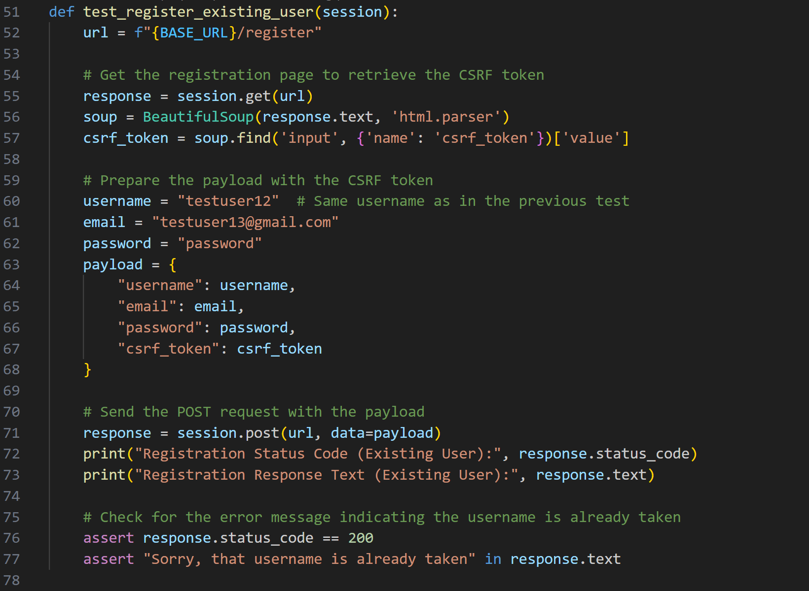
- Sends a GET request to the registration page to retrieve the page's HTML content, which includes a CSRF token.
- Parses the HTML content using BeautifulSoup and extracts the CSRF token.
- Prepares a payload with the extracted CSRF token, a username that is already registered ("testuser12"), an email, and a password.
- Sends a POST request to the registration page with the prepared payload, simulating a registration attempt with an existing username.
- Checks the response status code and text, asserting that: the status code is 200 (OK), indicating a successful response. The response text contains an error message indicating that the username is already taken ("Sorry, that username is already taken").

7. Create test case "test_login". It tests the login functionality of the application to ensure that it works as expected.
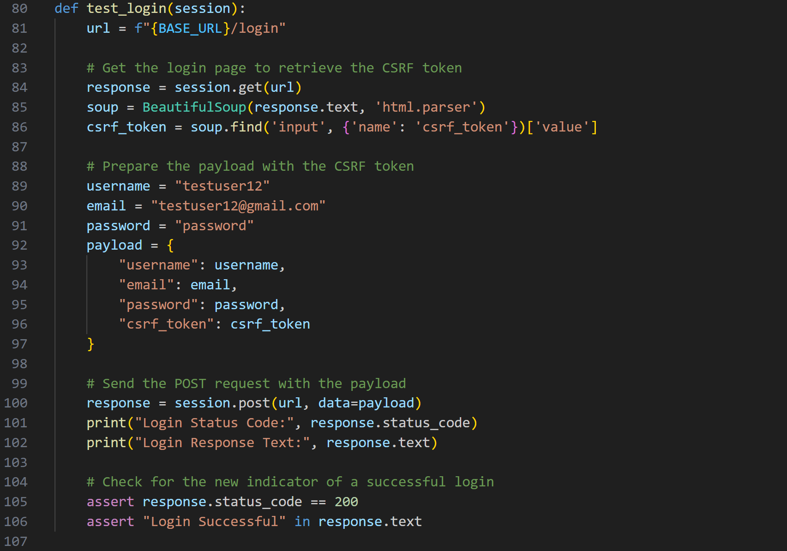
- Retrieves the login page to extract a CSRF token.
- Prepares a payload with the token, username, email, and password.
- Sends a POST request to the login page with the payload.
- Verifies that the login was successful by checking the response status code (200) and the presence of "Login Successful" in the response text.

8.Create test case "test_login_invalid_credentials". It tests to verify that the login functionality correctly handlesinvalid credentials.
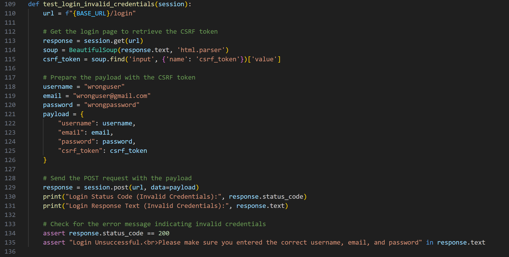
- Retrieves the login page to extract a CSRF token.
- Prepares a payload with the wrong login credentials (username, email, and password) and the CSRF token.
- Sends a POST request to the login page with the payload.
- Verifies that the login was unsuccesful by checking the response status code (200) and the presence of "Login Unsuccessful. Please make sure you entered the correct username, email, and password".

9. Create test case "test_logout". It tests from logging in to logging out, and verifies that the application responds correctly to these actions.
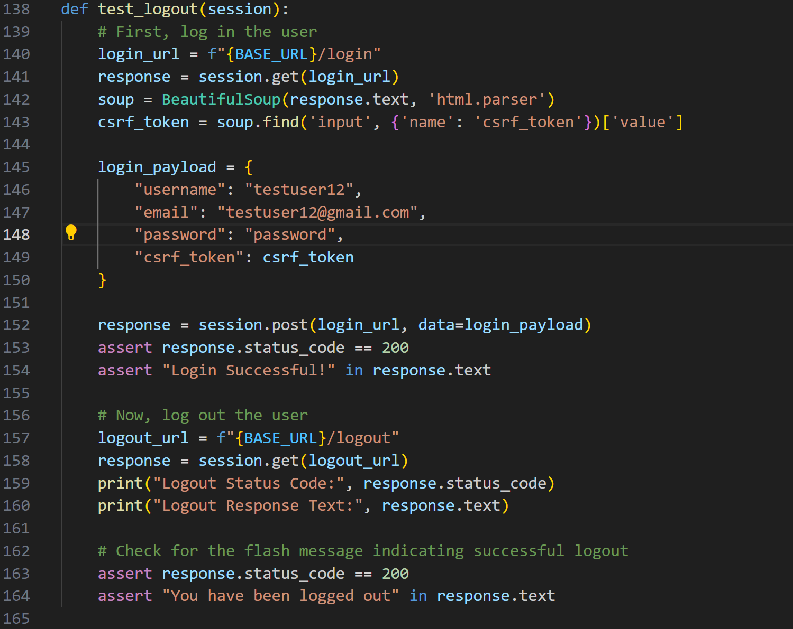
- Logs in a user  by sending a POST request to the login URL.
- After verifying a successful login, it sends a GET request to the logout URL to log out the user.
- Checks if the logout was successful by verifying the response status code (200) and the presence of "You have been logged out" in the response text.

10. CReate test case "test_get_current_weather". It tests to see if the API endpoint for fetching current weather data returns a successful response and contains the expected data.  
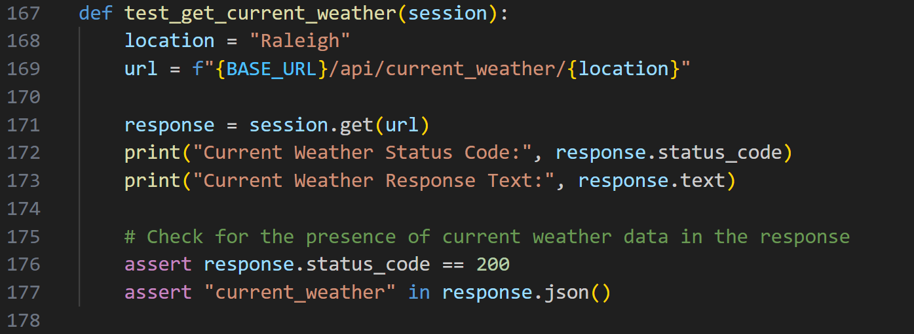
- Sends a GET request to the API endpoint for current weather data in Raleigh.
- Asserts that the status code is 200 (OK) and that the response contains the key "current_weather" in its JSON data.

11. Create test case "test_get_daily_weather". It test to see if the API endpoint for fetching daily weather data returns a successful response and contains the expected data.  
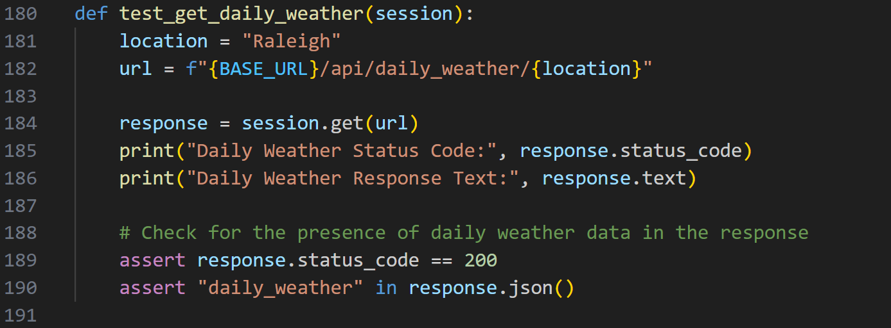
- Sends a GET request to the API endpoint for daily weather data in Raleigh.
- Asserts that the status code is 200 (OK) and that the response contains the key "daily_weather" in its JSON data.

12. Create test cast "test_get_hourly_weather". It tests to see if the API endpoint for fetching hourly weather data returns a successful response and contains the expected data.
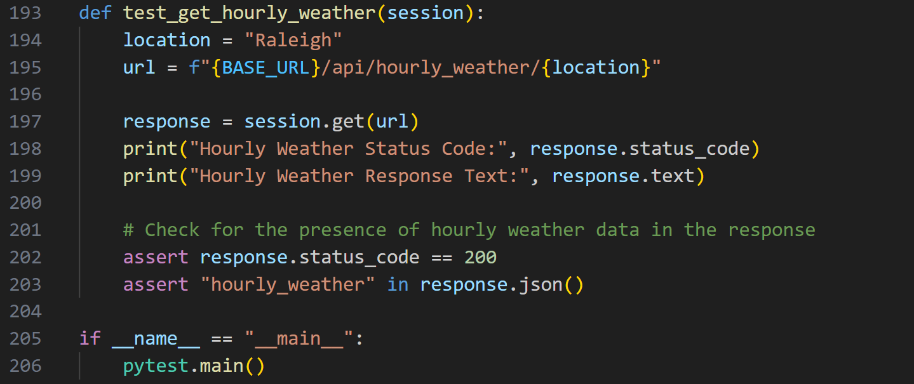
- Sends a GET request to the API endpoint for current weather data in Raleigh.
- Asserts that the status code is 200 (OK) and that the response contains the key "hourly_weather" in its JSON data.

13. Run the test. Open a new command prompt seperate from the one running the application. Enter this command:
```bash
pytest test_requests_api.py
```
If you would like to see the print statements from the functions for debugging enter this command, careful it is a lot of data!:
```bash
pytest -s test_requests_api.py
```
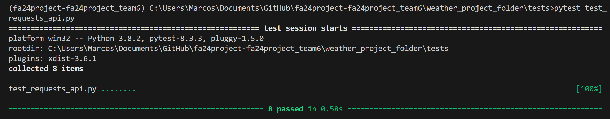
