# Robot Framework Lab

The main focus of this lab is to teach students acceptance testing using Robot Framework, SeleniumLibrary, RequestsLibrary, and Oracle Forecast developed by Team 6. 

## Intro to Robot Framework

Robot Framework is one of many automation frameworks, it is used for test automation and robotic process automation. It uses a keyword-driven approach, making it easy to create 
readable and reusable test cases, this allows both technical and non-technical team members to understand and contribute to testing. Robot Framework generates detailed logs 
and reports in HTML format, providing clear insights into test results and helping identify issues quickly. Follow this link to learn more about
[Robot Framework](https://robotframework.org/robotframework/latest/RobotFrameworkUserGuide.html).


## Lab Objective

Using Robot Framework, SeleniumLibrary, and the RequestsLibrary, users will create a variety of tests designed to meet the specifications outlined in the following business requirements.
Robot Framework will serve as the main framework to organize and execute the test cases, ensuring that the application meets the specified acceptance criteria.
## Business Requirements for Acceptance Testing

Based on the user stories found throughout the sprint files in the project documentation the following business requirements can be used to create our acceptance tests:
- Account Registration - The system shall provide a registration form for new users to create an account.
The registration process shall be quick and easy, requiring minimal information (e.g., username, email, password).
- Login - The system shall provide a login form for users to access their accounts.
The login process shall be quick and easy, allowing users to access the weather application promptly.
- Current Weather Data - The system shall display the current weather data for the user's selected location.
The weather data shall include temperature, humidity, wind speed, and other relevant metrics.
- Hourly Weather Data - The system shall display hourly weather data for the user's selected location.
The hourly data shall include temperature, chance of precipitation, and other relevant metrics.
- Daily Weather Forecast - The system shall display a daily weather forecast for the user's selected location.
The daily forecast shall include temperature, chance of precipitation, and other relevant metrics.

## Prerequisites

- Ensure you have performed the "environment_setup.md" lab before beginning. 
- Familiarity with Python 3.8 or later (this lab will use Visual Studio Code for Windows as the IDE, and Google Chrome 
for the browser).
- Familiarity with Python for writing test scripts.
- Familiarity with web technologies such as CSS, HTML.
- Familiarity with Python virtual environments.
- Familiarity using the command prompt.
- Some familiarity with Robot Framework.
- Basic troubleshooting skills.
  
## Packages and Libraries Used

- Robot Framework will manage and execute the test cases.
- SeleniumLibrary will handle the UI testing to ensure the user interface meets the acceptance criteria.
- RequestsLibrary will verify the backend APIs to ensure they provide the correct data.
  
## Instructions

### Step 1: Setup

1. Ensure you have performed the "environment_setup.md" lab.
2. If the "environment_setup.md" lab was performed succesfully then Robot Framework, SeleniumLibrary, and RequestsLibrary should already be install on the machine.
3. Navigate to the tests folder in the project directory.
4. Create a new folder named acceptancetests and navigate into it.
5. Create a new file named test_robot_acceptance.robot.
6. Open a command prompt and use the following to launch the flask application. You may need to cd into the weather_project_folder directory.

```bash
flask run
``` 

### Step 2: Step by Step Creating Test Cases

1. Create "Settings" section. The settings section in a Robot Framework test file helps to organize and manage the test suite by defining which libraries to use and what setup and teardown actions to perform, ensuring a consistent testing environment.
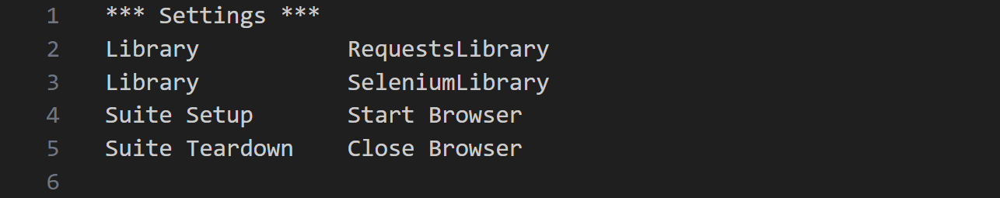
- Library: This keyword is used to import external libraries that provide additional functionalities for the tests.

2. Create "Variables" section. The Variables section in a Robot Framework test file is used to define variables that can be reused throughout the test cases. This helps to make the tests more readable and maintainable.
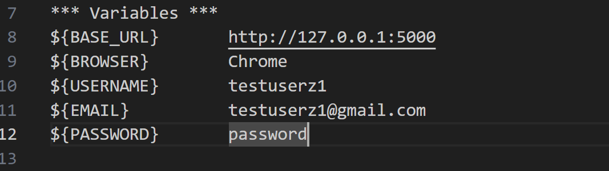
- ${BASE_URL}: This variable holds the base URL of the application, which is http://127.0.0.1:5000. It's used to navigate to the application in the test cases.
- ${BROWSER}: This variable specifies the browser to be used for testing, which is set to Chrome. It can be changed to other browswers such as Firefox or Edge, but that is not necessary for these tests.
- ${USERNAME}, ${EMAIL}, ${PASSWORD}: These variables store the user credentials for registration. They are used in the User Registration test case to input the username, email, and password. They are also used in the Login with Valid Credentials test case for user login validation.

3. Create test case "User Registration". This tests the user registration process.
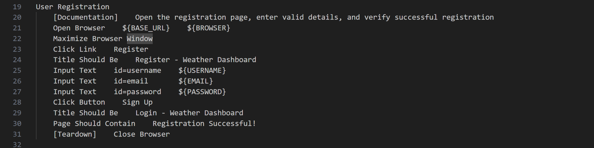
- Test Case Name: User Registration - This is the name of the test case. It should be descriptive enough to understand what the test is verifying.
- Documentation: [Documentation] - This tag provides a description of what the test case does. Here, it explains that the test will open the registration page, enter valid details, and verify successful registration.
- Open Browser: Open Browser ${BASE_URL} ${BROWSER} - This keyword opens a browser (specified by ${BROWSER}, which is Chrome in this case) and navigates to the base URL (${BASE_URL}).
- Maximize Browser Window: Maximize Browser Window - This keyword maximizes the browser window to ensure all elements are visible and accessible.
- Click Link: Click Link Register: This keyword clicks on the link with the text "Register" to navigate to the registration page.
- Title Should Be: Title Should Be Register - Weather Dashboard - This keyword verifies that the page title is "Register - Weather Dashboard", ensuring that the correct page is loaded.
- Input Text: Input Text id=username ${USERNAME} - This keyword inputs the text stored in ${USERNAME} into the input field with the ID username.
- Input Text: Input Text id=email ${EMAIL} - This keyword inputs the text stored in ${EMAIL} into the input field with the ID email.
- Input Text: Input Text id=password ${PASSWORD} - This keyword inputs the text stored in ${PASSWORD} into the input field with the ID password.
- Click Button: Click Button Sign Up - This keyword clicks the button with the text "Sign Up" to submit the registration form.
- Title Should Be: Title Should Be Login - Weather Dashboard - This keyword verifies that the page title changes to "Login - Weather Dashboard", indicating that the user has been redirected to the login page after successful registration.
- Page Should Contain: Page Should Contain Registration Successful! - This keyword checks that the page contains the text "Registration Successful!", confirming that the registration was successful.
- Teardown: [Teardown] Close Browser - This tag specifies actions to be performed after the test case executes. Here, it closes the browser to clean up after the test.

4. Create test case "Login with Valid Credentials". This tests the login process with valid credentials.
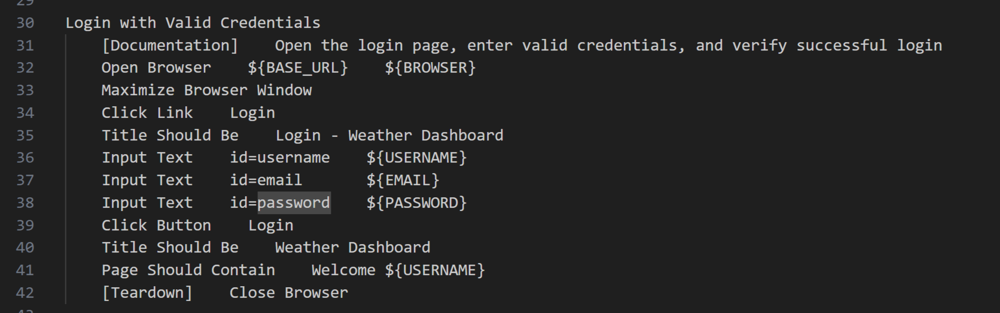
- Opens the browser and navigates to the base URL.
- Maximizes the browser window.
- Clicks the "Login" link.
- Verifies the page title is "Login - Weather Dashboard".
- Inputs the username, email, and password.
- Clicks the "Login" button.
- Verifies the page title changes to "Weather Dashboard" and that the page contains the text "Welcome ${LOGIN_USER}".
- Closes the browser.

5. Create test case "Login with Invalid Credentials". This tests the login process with invalid credentials.
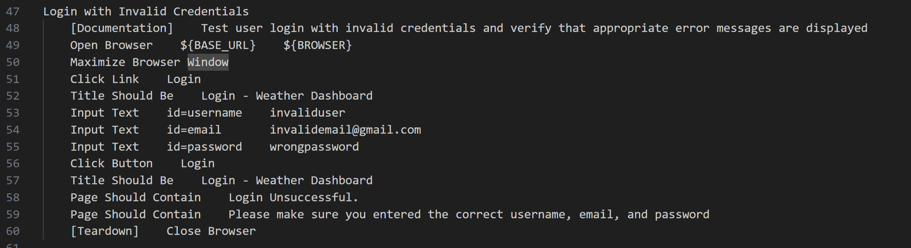
- Opens the browser and navigates to the base URL.
- Maximizes the browser window.
- Clicks the "Login" link.
- Verifies the page title is "Login - Weather Dashboard".
- Inputs invalid username, email, and password.
- Clicks the "Login" button.
- Verifies the page title remains "Login - Weather Dashboard" and that the page contains the error messages.
- Closes the browser.

6. Create test case "User Logout". This tests the logout functionality of the application.
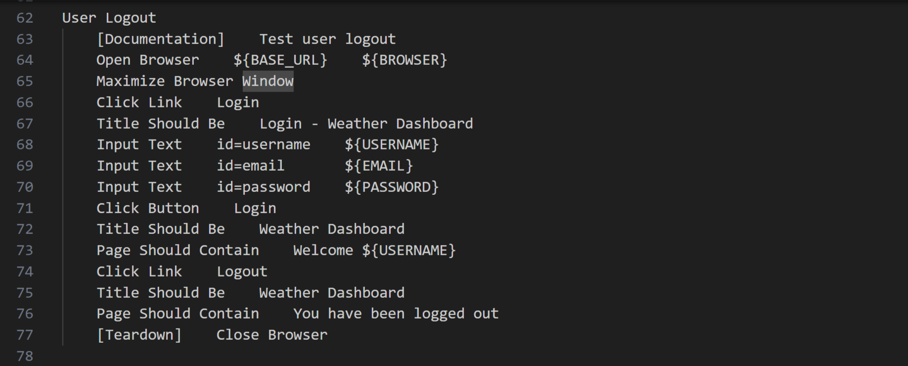
- Opens the browser and navigates to the base URL.
- Maximizes the browser window.
- Logs in with valid credentials.
- Verifies successful login.
- Clicks the "Logout" link.
- Verifies the page title changes to "Weather Dashboard" and that the page contains the text "You have been logged out".
- Closes the browser.

7. Create test case "Fetch Current Weather". This test case verifies that the API endpoint for fetching current weather data is working correctly.
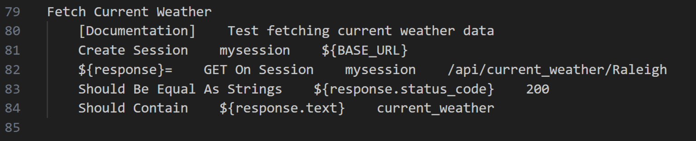
- Test Case Name: Fetch Current Weather - This is the name of the test case. It should be descriptive enough to understand what the test is verifying.
- Documentation: [Documentation] - This tag provides a description of what the test case does. Here, it explains that the test will fetch current weather data.
- Create Session: Create Session mysession ${BASE_URL} - This keyword creates a new HTTP session named mysession with the base URL ${BASE_URL}. This session will be used to send HTTP requests to the server.
- GET On Session: GET On Session mysession /api/current_weather/Raleigh - This keyword sends a GET request to the /api/current_weather/Raleigh endpoint using the mysession session. The response from this request is stored in the ${response} variable.
- Should Be Equal As Strings: Should Be Equal As Strings ${response.status_code} 200 - This keyword verifies that the status code of the response is 200, indicating that the request was successful.
- Should Contain: Should Contain ${response.text} current_weather - This keyword checks that the response text contains the string current_weather, confirming that the correct data is being returned.

8. Create test case "Fetch Daily Weather". This test case verifies that the API endpoint for fetching daily weather data is working correctly.
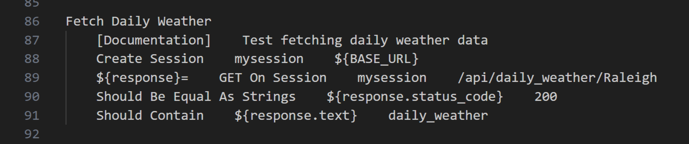
- Creates a session with the base URL.
- Sends a GET request to the /api/daily_weather/Raleigh endpoint.
- Verifies the response status code is 200.
- Verifies the response contains the text daily_weather.

9. Create test case "Fetch Hourly Weather". This test case verifies that the API endpoint for fetching daily weather data is working correctly.

- Creates a session with the base URL.
- Sends a GET request to the /api/hourly_weather/Raleigh endpoint.
- Verifies the response status code is 200.
- Verifies the response contains the text hourly_weather.

10. Create "Keywords" section. The Keywords section in a Robot Framework test file is used to define custom keywords that can be reused across multiple test cases.
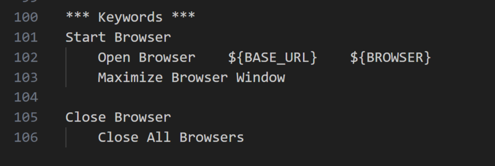
- Keyword Name: Start Browser - This is the name of the custom keyword. It should be descriptive enough to understand what the keyword does. It encapsulates the steps to start the browser and navigate to the base URL. Open Browser ${BASE_URL} ${BROWSER}: Opens the browser specified by the ${BROWSER} variable (Chrome) and navigates to the base URL specified by the ${BASE_URL} variable. Maximize Browser Window: Maximizes the browser window to ensure that the entire page is visible.
Keyword Name: Close Browser - This is the name of the custom keyword. It encapsulates the step to close all open browser windows. Close All Browsers: Closes all browser windows that were opened during the test execution.

11. Run the tests. Open a new command prompt seperate from the one running the application. CD into the acceptancetests folder and enter this command:
```bash
robot test_robot_acceptance.robot
```
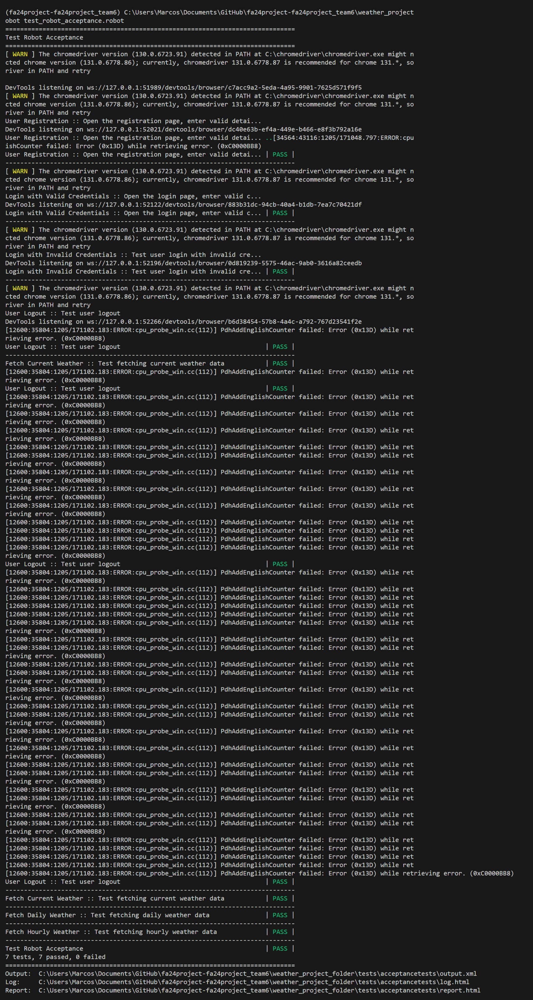
Ignore the error messages on the screen, those have to do with my local machine and do not affect the Robot Framework Tests.
Observe how Robot Framework uses Selenium to take control of the web browser, it then uses the Requests library to test the weather API endpoints. It then created reports detailing the tests.

## Try it Yourself

Now that you have a decent understanding of how Robot Framework functions, update the User Registration to use the "Start Browser" keyword. Notice how it wasn't used in any of the tests 
but the "Close Browser" keyword was? It should be fairly straightforward to update it to use the keyword. 

## Results Overview
The test_robot_acceptance.robot file aligns well with the business requirements we set out to test. We were able to conclude that the application provides users with easy to use registration, login, and weather fetching functionalities. 

## Coverage Reports
After running the file, Robot Framework generated reports that provide detailed insights into the test execution, helping stake holders understand the results, identify issues, and ensure that the application meets the specified requirements. They provide a summary of the test results, which ones passes, which ones failed, etc. The reports hilight any erros or failures that occured and provide detailed error messages. The reports provide a clear and consice way of communicating the test results to stake holders. 
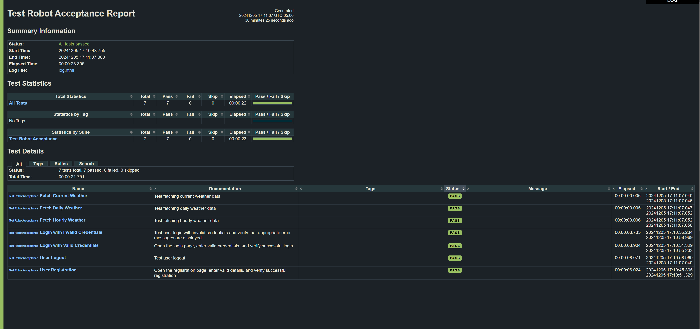

### Troubleshooting Tips

- If any tests fail ensure they are setup properly. Run the test again, sometimes a test will fail due to network issues, latency issues etc. 
