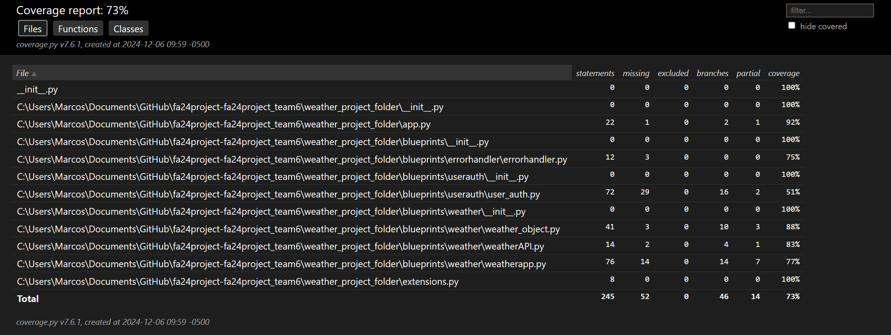
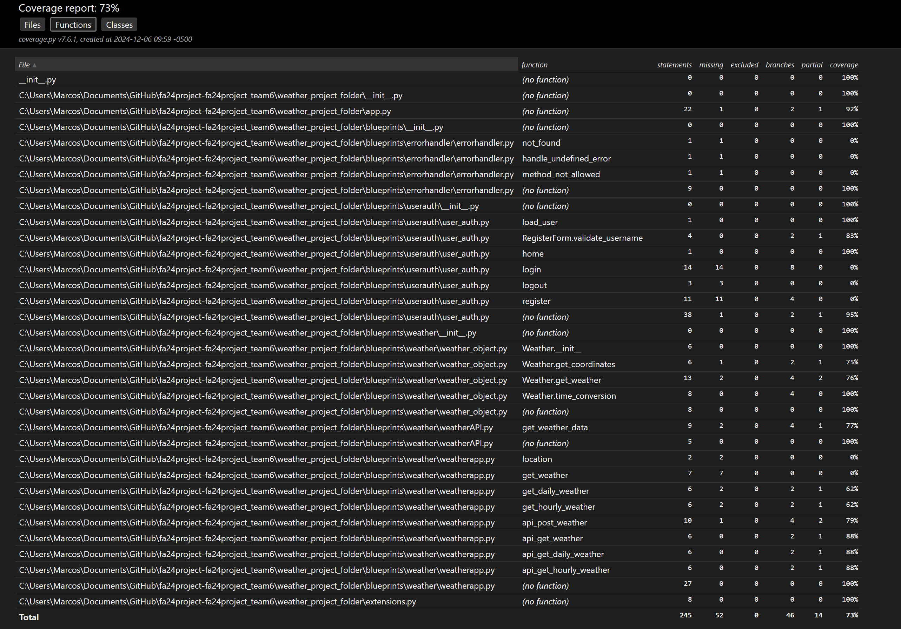
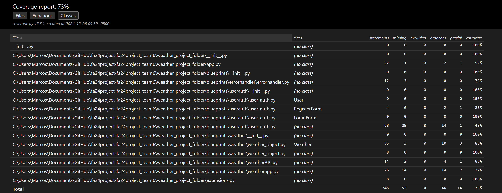
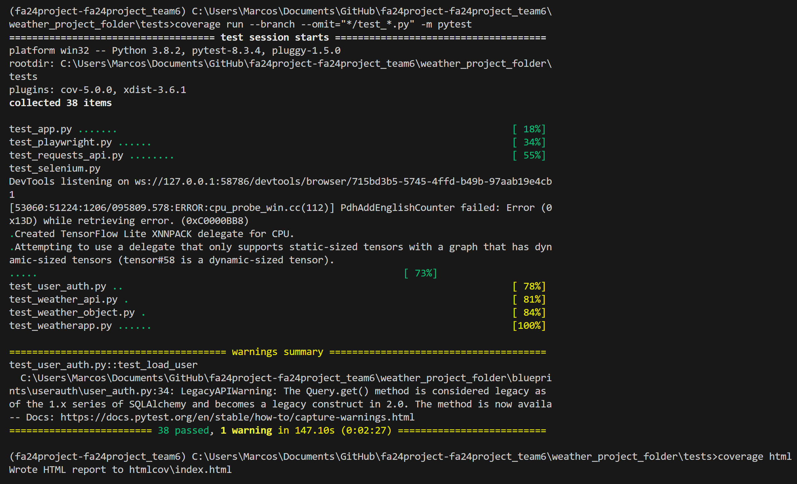

# Code Coverage Report

## 1. Introduction

### Purpose of the Report

- This report aims to provide a comprehensive analysis of the test coverage for the `Oracle Forecast` project, highlighting areas of strength and identifying opportunities for improvement

### Scope of Coverage

- The scope of this report encompasses the entire codebase of the `Oracle Forecast` project, including all modules, components, and functions.

### Tools Used for Generating the Report
- `pytest`
- `coverage.py`

## 2. Executive Summary

### Overall Coverage Percentage
- The project has achieved an overall test coverage of **73%**, indicating a solid foundation of tested
code.

### Key Findings
- Significant coverage has been achieved in modules such as `app.py` and `weather_object.py`, while modules like `weatherapp.py` and `user_auth.py` exhibit lower coverage, necessitating further testing.

### Recommendations
- To enhance the robustness of the application, it is recommended to increase test coverage in modules with lower coverage, particularly `user_auth.py` and `weatherapp.py`. Additionally, critical functions with minimal or no coverage should be prioritized for testing

## 3. Coverage Metrics

### Line Coverage
- Percentage of lines of code executed: **73%**

### Statement Coverage
- Percentage of statements executed: **73%**

## 4. Detailed Coverage Analysis

### By Module/Component

- The following sections provide a detailed breakdown of coverage by module, highlighting specific functions and their respective coverage percentages.

#### Module: `__init__.py`
- **Coverage**: 100%
- **Functions**: None

#### Module: `app.py`
- **Coverage**: 92%
- **Functions**:
  - **(no function)**: 92% (22 statements, 1 missing, 2 branches, 1 partial)

#### Module: `blueprints/__init__.py`
- **Coverage**: 100%
- **Functions**: None

#### Module: `blueprints/errorhandler/errorhandler.py`
- **Coverage**: 75%
- **Functions**:
  - `not_found`: 0% (1 statement, 1 missing)
  - `handle_undefined_error`: 0% (1 statement, 1 missing)
  - `method_not_allowed`: 0% (1 statement, 1 missing)
  - **(no function)**: 100% (9 statements, 0 missing)

#### Module: `blueprints/userauth/__init__.py`
- **Coverage**: 100%
- **Functions**: None

#### Module: `blueprints/userauth/user_auth.py`
- **Coverage**: 51%
- **Functions**:
  - `load_user`: 100% (1 statement, 0 missing)
  - `RegisterForm.validate_username`: 83% (4 statements, 0 missing, 2 branches, 1 partial)
  - `home`: 100% (1 statement, 0 missing)
  - `login`: 0% (14 statements, 14 missing, 8 branches)
  - `logout`: 0% (3 statements, 3 missing)
  - `register`: 0% (11 statements, 11 missing, 4 branches)
  - **(no function)**: 95% (38 statements, 1 missing, 2 branches, 1 partial)

#### Module: `blueprints/weather/__init__.py`
- **Coverage**: 100%
- **Functions**: None

#### Module: `blueprints/weather/weatherAPI.py`
- **Coverage**: 83%
- **Functions**:
  - `get_weather_data`: 77% (9 statements, 2 missing, 4 branches, 1 partial)
  - **(no function)**: 100% (5 statements, 0 missing)

#### Module: `blueprints/weather/weather_object.py`
- **Coverage**: 88%
- **Functions**:
  - `Weather.__init__`: 100% (6 statements, 0 missing)
  - `Weather.get_coordinates`: 75% (6 statements, 1 missing, 2 branches, 1 partial)
  - `Weather.get_weather`: 76% (13 statements, 2 missing, 4 branches, 2 partial)
  - `Weather.time_conversion`: 100% (8 statements, 0 missing, 4 branches)
  - **(no function)**: 100% (8 statements, 0 missing)

#### Module: `blueprints/weather/weatherapp.py`
- **Coverage**: 77%
- **Functions**:
  - `location`: 0% (2 statements, 2 missing)
  - `get_weather`: 0% (7 statements, 7 missing)
  - `get_daily_weather`: 62% (6 statements, 2 missing, 2 branches, 1 partial)
  - `get_hourly_weather`: 62% (6 statements, 2 missing, 2 branches, 1 partial)
  - `api_post_weather`: 79% (10 statements, 1 missing, 4 branches, 2 partial)
  - `api_get_weather`: 88% (6 statements, 0 missing, 2 branches, 1 partial)
  - `api_get_daily_weather`: 88% (6 statements, 0 missing, 2 branches, 1 partial)
  - `api_get_hourly_weather`: 88% (6 statements, 0 missing, 2 branches, 1 partial)
  - **(no function)**: 100% (27 statements, 0 missing)

#### Module: `extensions.py`
- **Coverage**: 100%
- **Functions**: None

### By File/Class
- **File `__init__.py`**: **100%** coverage
- **File `app.py`**: **92%** coverage
- **File `blueprints/__init__.py`**: **100%** coverage
- **File `blueprints/errorhandler/errorhandler.py`**: **75%** coverage
- **File `blueprints/userauth/user_auth.py`**: **51%** coverage
- **File `blueprints/weather/weatherAPI.py`**: **83%** coverage
- **File `blueprints/weather/weather_object.py`**: **88%** coverage
- **File `blueprints/weather/weatherapp.py`**: **77%** coverage
- **File `extensions.py`**: **100%** coverage

## 5. Uncovered Code Analysis

### List of Uncovered Functions/Methods
- **Module `blueprints/userauth/user_auth.py`**:
  - `login`: 0% coverage
  - `logout`: 0% coverage
  - `register`: 0% coverage

### List of Uncovered Lines/Statements
- **Module `blueprints/userauth/user_auth.py`**:
  - Lines in `login`, `logout`, and `register` functions

## 6. Test Case Analysis

### Number of Test Cases Executed
- A total of **38** test cases were executed

### Number of Test Cases Passed/Failed
- Passed: **38**
- Failed: **0**

## 8. Quality and Risk Assessment

### Potential Risks Due to Low Coverage Areas
- **Module `blueprints/userauth/user_auth.py`** has low coverage, which may lead to undetected bugs in user authentication functionality.

### Impact on Software Quality
- While high coverage in critical modules ensures reliability, the low coverage in user authentication highlights a potential vulnerability that must be addressed to maintain overall software quality.

### Areas Needing Additional Testing
- **Module `blueprints/userauth/user_auth.py`**
- **Module `blueprints/weather/weatherapp.py`**

## 9. Recommendations and Action Items

### Suggested Improvements in Test Coverage
- To improve test coverage, focus on writing additional tests for the `user_auth.py` and `weatherapp.py` modules. This will help mitigate risks and enhance the overall robustness of the application.
- 
### Specific Areas to Focus On
- Prioritize testing critical functions within the `user_auth.py` module to ensure comprehensive coverage and reduce potential vulnerabilities.

### Action Plan for Addressing Low Coverage
- Assign dedicated team members to write tests for uncovered areas, and schedule regular coverage reviews to monitor progress and ensure continuous improvement.

## 10. Conclusion

### Summary of Findings
- In summary, the `Oracle Forecast` project has achieved an overall coverage of **73%**. While critical modules exhibit high coverage, areas such as user authentication require additional testing to mitigate risks.

### Final Recommendations
- To maintain and improve software quality, it is essential to increase coverage in low-coverage areas, regularly monitor coverage reports, and update the test suite as needed.

## 11. Appendices

### Detailed Coverage Reports

### References to Tools and Resources Used
- [Coverage.py](https://coverage.readthedocs.io/en/7.6.9/)
- [Pytest](https://docs.pytest.org/en/stable/contents.html)

