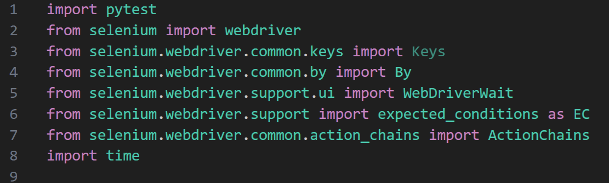
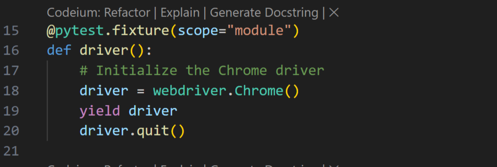
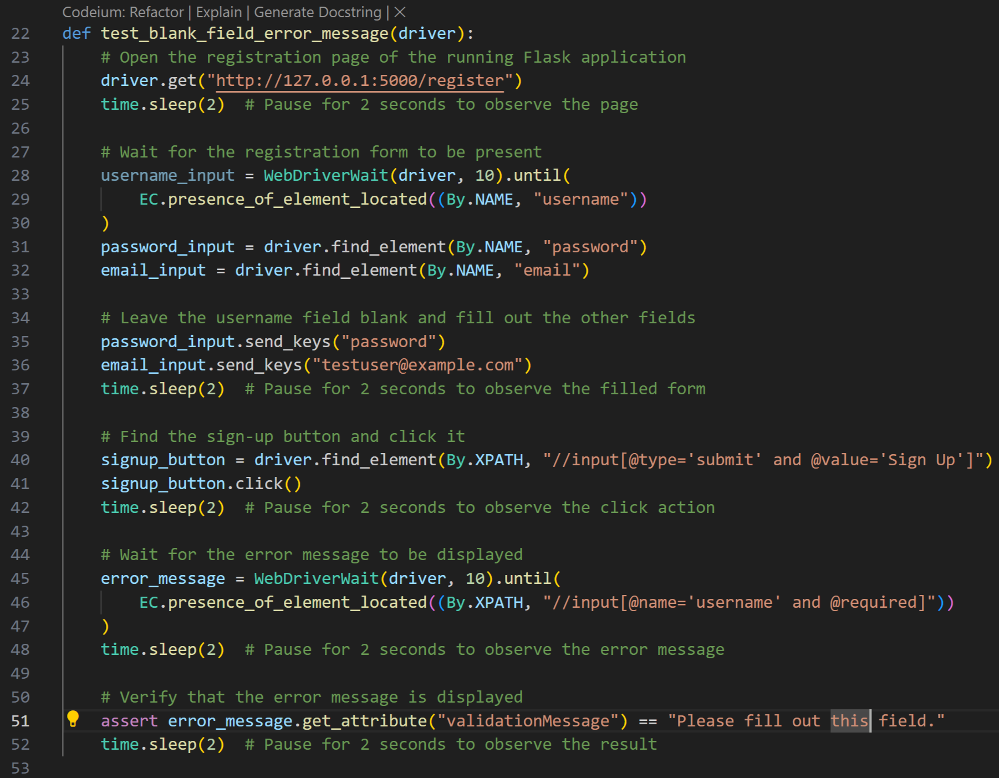
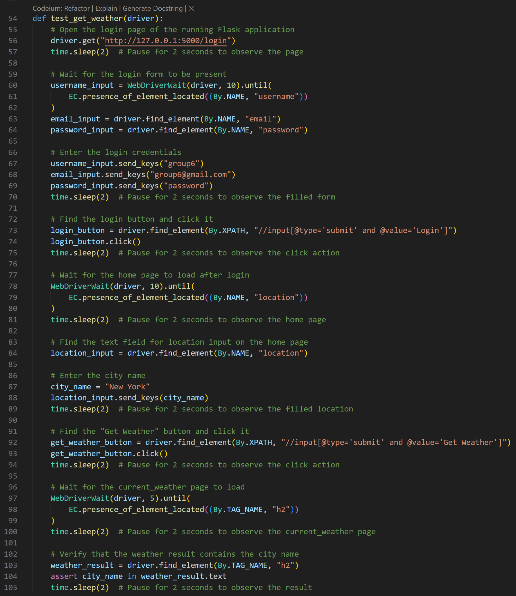
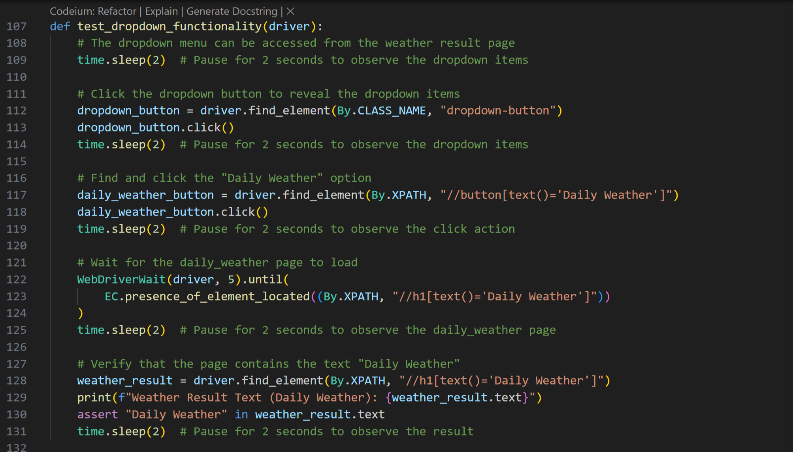
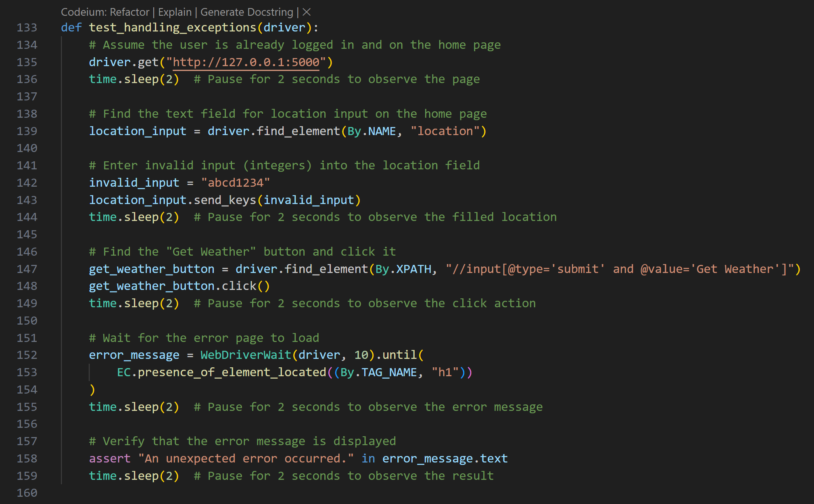
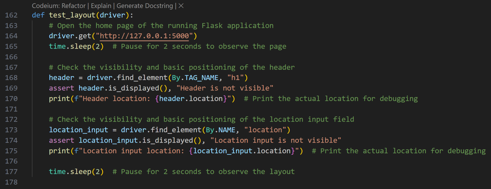
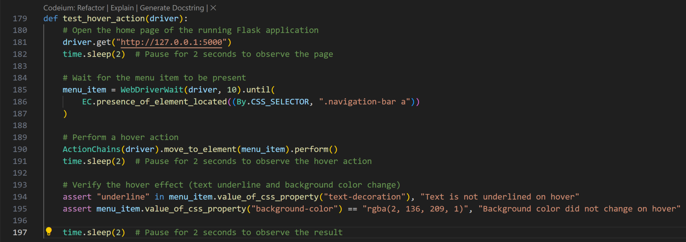

# Selenium Lab

The main focus of this lab is to teach students automation testing using Selenium WebDriver, various other tools, and Oracle Forecast developed by Team 6.

## Intro to Selenium

Selenium WebDriver is a tool for automating web application testing. It allows testers to simulate user actions like clicking buttons, entering text, and navigating between pages, among many others. It supports a variety of web browsers and programming languages; however, this lab will focus on Chrome and Python exclusively. Follow this link to read and learn a little more about [Selenium](https://www.selenium.dev/documentation/overview/).

## Lab Objective

Using Selenium WebDriver, Python, and the pytest library, students will create a variety of tests that will cover the following: form submissions, link and button clicks, dropdown menus, mouse actions, keyboard inputs, layout testing, page navigation, data entry and retrieval, data validation, error messages, and exception handling.

## Prerequisites

- Ensure you have performed the "environment_setup.md" lab before beginning. 
- Familiarity with Python 3.8 or later (this lab will use Visual Studio Code for Windows as the IDE, and Google Chrome 
for the browser).
- Familiarity with Python for writing test scripts.
- Familiarity with web technologies such as CSS, HTML.
- Familiarity with Python virtual environments.
- Familiarity using the command prompt.
- Some familiarity with Selenium WebDriver.
- Basic troubleshooting skills.
  
## Packages and Libraries Used

- Selenium Webdriver - A browser automation tool used to automate web browswer interactions.
- Pytest - A testing framework used to write and execute simple and scalable test cases.
- Time - The time module is used for various time related functions.
  
## Instructions

### Step 1: Setup

1. Ensure you have performed the environment_setup lab.
2. Navigate to the tests folder in the project directory.
3. Create a new file name test_selenium.py
4. Open a command prompt and use the following to launch the flask application. You may need to cd into the weather_project_folder directory.

```bash
flask run
```
5. Once the application is running open it in Chrome, navigate to the registration page and create a user with the following credentials (username: group6, email: group6@gmail.com, password: password), if the user already exists continue ahead with the lab. 

### Step 2: Step by Step Creating Test Cases

1. In the test_selenium.py file import the necessary libraries and modules.


- Pytest: Used for running the test functions.
- Webdriver: Provides the WebDriver to control the browser.
- Keys: Provides keyboard interactions.
- By: Used to locate elements.
- WebDriverWait: Used to wait for conditions.
- Expected_conditions as EC: Provides conditions to wait for.
- ActionChains: Used to perform complex user interactions.
- Time: Used to pause the execution.

2. Define a pytest fixture to set up and tear down the WebDriver. Fixtures offer a few benefits such as
improving test isolation, eliminating code duplication, and others.


3. Create a test function "test_blank_field_error_message". This test function is testing the functionality of the registration page to ensure that an error message is displayed when a user tries to register with a blank username field.


- Function takes a driver parameter, which is an instance of the Selenium WebDriver.
- Opens the registration page of the Flask application by navigating to http://127.0.0.1:5000/register using the driver.get() method.
- Waits for 2 seconds to observe the page.
- Waits for the registration form to be present using WebDriverWait and EC.presence_of_element_located() method. It finds the username input field, password input field, and email input field.
- Fills out the password and email fields with specific values.
- Waits for 2 seconds to observe the filled form.
- Finds the sign-up button using XPath and clicks it. Xpath is a way to locate elements in an HTML or XML document. In this case it is used to find an input element of the type "submit" that has a value of "Sign Up".
- Waits for 2 seconds to observe the click action.
- Waits for the error message to be displayed using WebDriverWait and EC.presence_of_element_located() method. It finds the error message element.
- Waits for 2 seconds to observe the error message.
- Verifies that the error message is displayed by asserting that the validationMessage attribute of the error message element is equal to "Please fill out this field."
- Waits for 2 seconds to observe the result of the assertion.

4. Create a test function "test_get_weather". It tests the functionality of the web application by simulating various user interactions.

- Opens the login page, waits for the login form to load, enters credentials (group6, group6@gmail.com, password), and clicks the login button.
- After login, the test waits for the home page to load and finds the location input field.
- Enters a city name (New York) into the location input field and clicks the "Get Weather" button.
- Waits for the current weather page to load and checks if the weather result contains the entered city name (New York).
- Waits for specific elements to be present on the page, ensuring that the test doesn't fail due to timing issues. The time.sleep() statements are used to pause the test for a few seconds, allowing the user to observe the interactions.

5. Create a test function "test_dropdown_functionality". It tests the functionality of the dropdown menu in the web application.

- Clicks the dropdown button to reveal the options.
- Clicks the "Daily Weather" option.
- Waits for the daily weather page to load.
- Verifies that the page contains the text "Daily Weather".

6. Create a test function "test_handling_exceptions". It simulates a user entering invalid input and verifies that an error message is displayed.

- Navigates to the home page (http://127.0.0.1:5000).
- Enters invalid input ("abcd1234") into the location field.
- Clicks the "Get Weather" button.
- Waits for the error page to load.
- Verifies that the error message "An unexpected error occurred." is displayed.

7. Create a test function "test_layout". It verifies the layout of the homepage.

- Navigates to the home page (http://127.0.0.1:5000).
- Checks if an h1 header element is visible on the page and prints its location.
- Checks if a text input field with the name "location" is visible on the page and prints its location.
  
8. Create a test function "test_hover_action". It tests the funcionality of the hover action when a user hovers their mouse over an item.

- Navigates to the home page (http://127.0.0.1:5000).
- Performs a hover action on the menu item using Selenium's ActionChains class.
- Verifies that the hover effect is applied correctly by checking the text decoration and background color of the menu item using CSS properties.
